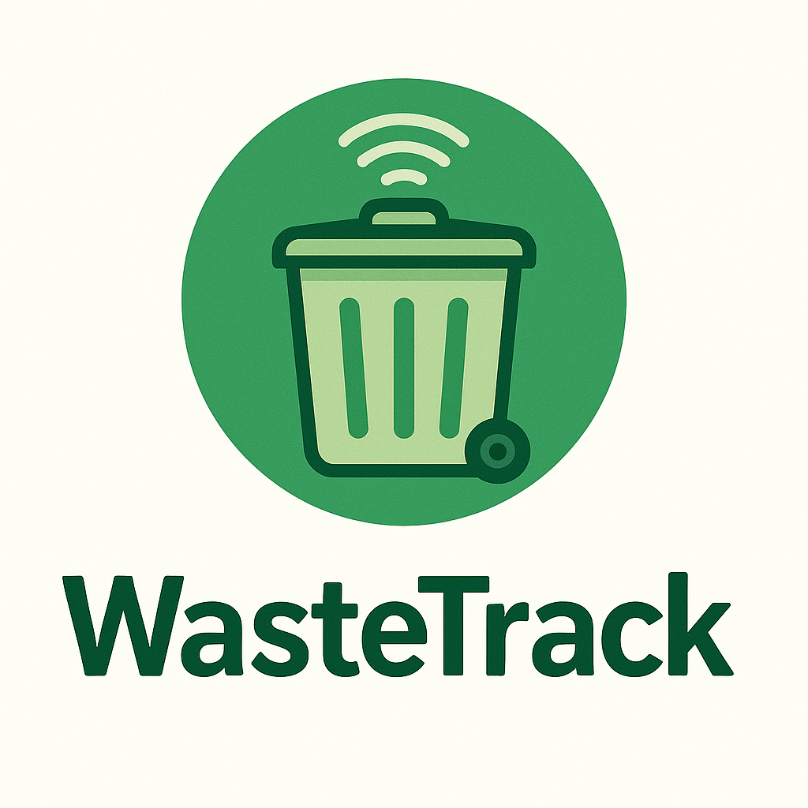
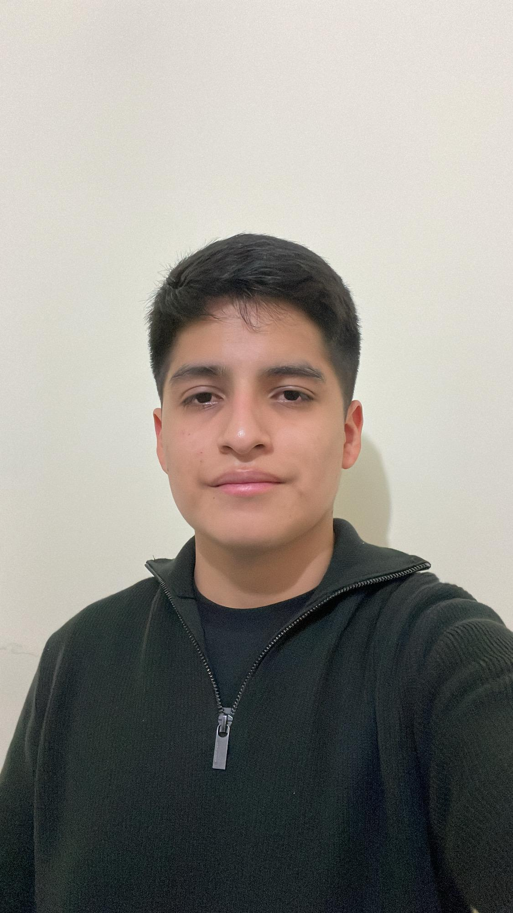

## **Capítulo I: Presentación**

### **1.1. Startup Profile**

#### **1.1.1. Descripción de la Startup**

**WasteTrack** es una startup innovadora dedicada a transformar la gestión de residuos urbanos a través de la tecnología. Mediante el uso de sensores IoT, nuestra plataforma permite monitorear en tiempo real el nivel de llenado de los contenedores de residuos, optimizando las rutas de recolección de basura de manera eficiente. A través de una interfaz intuitiva, los usuarios municipales pueden configurar y gestionar de forma individualizada cada contenedor, ajustando parámetros como el umbral de llenado, el tipo de residuo, los horarios de recolección y la prioridad. Al mismo tiempo, los ciudadanos pueden acceder a una interfaz básica que les permite visualizar el recorrido estimado de los camiones recolectores en su zona, promoviendo la transparencia y la colaboración en la gestión de residuos. El objetivo de WasteTrack es mejorar la eficiencia del servicio de recolección, reducir los costos operativos, evitar el desbordamiento de residuos y contribuir a la sostenibilidad de las ciudades.

 

**Misión:**  
Facilitar la gestión inteligente de los residuos urbanos mediante tecnología avanzada, optimizando las rutas de recolección y promoviendo la participación activa de los ciudadanos en el proceso de limpieza urbana. Buscamos empoderar a los municipios con herramientas eficaces para tomar decisiones basadas en datos, mientras incentivamos a los ciudadanos a participar activamente en el mantenimiento de una ciudad más limpia.

**Visión:**  
Convertirnos en la plataforma líder de gestión de residuos urbanos, utilizando tecnología de vanguardia para mejorar la sostenibilidad y la eficiencia en las ciudades. Aspiramos a crear una red global de comunidades colaborativas que utilicen WasteTrack para optimizar sus servicios de recolección de basura, contribuyendo a un modelo de ciudad más limpia, eficiente y transparente.

### 1.1.2. Perfiles de integrantes del equipo

<table style="text-align:center">
    <thead>
        <tr>
            <th>Integrantes</th>
            <th>Descripción</th>
            <th>Conocimientos</th>
        </tr>
    </thead>
    <body >
        <tr>
            <!-- DATOS del integrante 1-->
            <td> 
             
             María Alejandra Díaz Villacrez U202118315 
            </td>
            <!-- DESCRIPCIÓN del integrante 1-->
            <td >Soy estudiante de 7to ciclo de la carrera de Ingeniería de Software y desarrolladora fullstack especializada en tecnologías .NET. Mis intereses son aprender nuevas tecnologías y el desarrollo de videojuegos.</td>
            <!-- CONOCIMIENTOS del integrante 1-->
            <td>Poseo conocimientos en los lenguajes de programación: C++, Python, JavaScript, C#, Java, entre otros. Me gusta trabajar en equipo y soy una persona responsable, lista para ayudar a los que lo necesiten. Puedo aportar mis habilidades técnicas y blandas para mejorar la eficacia de mi equipo</td>
        </tr>
        <tr>
            <!-- DATOS del integrante 2-->
            <td>
            
             Joaquin David Rivadeneyra Ramos - U202211846
            </td>
            <!-- DESCRIPCIÓN del integrante 2-->
            <td>Soy Joaquin Rivadeneyra, tengo 20 años y actualmente estoy cursando el 7to ciclo de la carrera de Ingeniería de Software. Me considero una persona comunicativa y abierta a nuevas ideas, lo que me permite tener una buena relación con los demás miembros del equipo y fomentar un ambiente de trabajo colaborativo..</td>
            <!-- CONOCIMIENTOS del integrante 2-->
            <td>Poseo habilidades en las que puedo aportar en el grupo son dominio y práctica de lenguajes de programación como Vue y Angular, documentación de proyectos y metodologías ágiles y conocimientos básicos de base de datos.</td>
        </tr>
        <tr>
            <!-- DATOS del integrante 3-->
            <td>
            
             Josue Daniel Valverde Lopez - U202121440
            </td>
            <td>Estudiante de la carrera de Ingeniería de Software en 8avo ciclo. Me gusta trabajar en equipo, aprender sobre nuevas tecnologías relacionadas a la inteligencia artificial y automatización de procesos.</td>
            <!-- CONOCIMIENTOS del integrante 2-->
            <td>Poseo conocimientos en desarrollo web fullstack usando frameworks como angular, vue, express y herramientas de nube como azure function apps, app services y cosmos db</td>
        </tr>
        <tr>
            <!-- DATOS del integrante 4-->
            <td>
            
             Nicolás Andrés Cortés Hidalgo U202016311
            </td>
            <!-- DESCRIPCIÓN del integrante 2-->
            <td>Estudiante de 22 años de la carrera de Ingeniería de Software y Practicante de desarrollo web; Me considero una persona competitiva, amable y con la que es fácil socializar. Mis intereses principales son el análisis de datos y todo lo relacionado a la ciberseguridad.</td>
            <!-- CONOCIMIENTOS del integrante 2-->
            <td>Mis conocimientos principales están orientados a los lenguajes de programación, destacando en C#, PHP y Java. Además de ello, tengo experiencia manejando los frameworks de Angular, .NET y Spring Boot. Me desenvuelvo muy bien con distintos tipos de personas, por lo que me resulta fácil trabajar en equipo, priorizando siempre el avance del o de los proyectos.</td>
        </tr>
        <tr>
            <!-- DATOS del integrante 5-->
            <td>
            
             Estudiante - CODIGO
            </td>
            <!-- DESCRIPCIÓN del integrante 2-->
            <td>Texto.</td>
            <!-- CONOCIMIENTOS del integrante 2-->
            <td>Texto.</td>
        </tr>
    </body>
</table>

### **1.2. Solution Profile**

#### **1.2.1 Antecedentes y problemática**

**Antecedentes**  
La gestión de residuos urbanos es un desafío continuo para muchas ciudades. Los métodos tradicionales de recolección a menudo resultan ineficientes, con rutas no optimizadas, desbordamiento de contenedores y altos costos operativos. Además, la falta de transparencia en el proceso de recolección hace que los ciudadanos pierdan confianza en el sistema.

**Problemática**  
La recolección de residuos enfrenta varios problemas, como el mal manejo de rutas, la falta de monitoreo en tiempo real y la escasa participación ciudadana. Los sistemas actuales carecen de eficiencia y transparencia, lo que genera inconvenientes tanto para los municipios como para los ciudadanos.

- **Who? (¿Quién?)**
  
  Los consumidores urbanos que enfrentan una mala gestión de residuos y las municipalidades que buscan mejorar sus operaciones de recolección.

- **What? (¿Qué?)**
  
  Necesitamos mejorar la transparencia en los precios, optimizar las rutas de recolección, proporcionar una interfaz amigable y fomentar la participación de los ciudadanos.

- **Where? (¿Dónde?)**
  
  Principalmente en áreas urbanas con alta densidad de población, pero también en zonas menos cubiertas que pueden beneficiarse de soluciones tecnológicas.

- **When? (¿Cuándo?)**
  
  Durante periodos de alta demanda, como festividades o eventos, es crucial implementar tecnologías que mejoren la recolección en tiempo real.

- **Why? (¿Por qué?)**
  
  Porque los métodos actuales son ineficientes y carecen de transparencia, lo que crea frustración tanto en los ciudadanos como en las municipalidades.

- **How? (¿Cómo?)**
  
  WasteTrack resuelve estos problemas mediante el uso de sensores IoT para monitorear los niveles de llenado y la optimización de rutas para los camiones recolectores. Además, proporciona a los ciudadanos una plataforma para visualizar el recorrido estimado del camión y participar activamente.

- **How Much? (¿Cuánto?)**
  
  El costo de implementar WasteTrack incluye desarrollo tecnológico, integración de IoT y marketing. Utilizamos un modelo de negocio basado en suscripciones y comisiones, lo que permite un flujo de ingresos sostenible para los socios comerciales.

#### **1.2.2 Lean UX Process**

#### **1.2.2.1. Lean UX Problem Statements**

---

La gestión de residuos urbanos tradicionalmente involucra una planificación de rutas ineficiente, contenedores desbordados y falta de visibilidad en tiempo real sobre el estado de los mismos, lo que genera un proceso poco transparente y difícil de gestionar para los municipios y los ciudadanos.

Las soluciones actuales de gestión de residuos suelen carecer de una plataforma unificada que optimice las rutas de recolección, permita el monitoreo en tiempo real y facilite la participación de los ciudadanos. Esto provoca frustración en los usuarios y una experiencia inconsistente en el proceso de recolección de residuos.

Nuestro producto, **WasteTrack**, abordará esta brecha a través de una plataforma web que ofrece una interfaz intuitiva para monitorear y gestionar contenedores de residuos, optimizar rutas de recolección y fomentar la participación activa de los ciudadanos en el mantenimiento de la limpieza urbana. La aplicación proporcionará información clara sobre el estado de los contenedores y las rutas de los camiones, promoviendo la eficiencia y la sostenibilidad en la gestión de residuos.

Nuestro enfoque inicial será dirigido a municipalidades que buscan optimizar la recolección de residuos y ciudadanos interesados en mejorar su contribución al cuidado del medio ambiente.

Sabremos que hemos tenido éxito cuando logremos una adopción del 30% entre las municipalidades dentro de los primeros 6 meses de implementación, y un índice de satisfacción superior al 80% medido a través de encuestas de los usuarios.

#### **1.2.2.2. Lean UX Assumptions**

---

**Business Assumptions:**

- Creemos que las municipalidades necesitan una forma más eficiente y transparente para gestionar la recolección de residuos.
- Estas necesidades se pueden resolver con una plataforma web que optimice las rutas de recolección, permita el monitoreo de contenedores y fomente la participación ciudadana.
- Nuestros clientes iniciales serán las municipalidades que buscan optimizar la recolección de residuos y los ciudadanos interesados en mejorar la gestión de su entorno.
- El valor principal que un cliente desea obtener de **WasteTrack** es un proceso de gestión de residuos simplificado y eficiente, con acceso en tiempo real a la información sobre el estado de los contenedores y las rutas de los camiones.
- Los beneficios adicionales incluyen la optimización de rutas, el monitoreo de contenedores, y la participación ciudadana para mejorar la limpieza urbana.
- Vamos a adquirir la mayoría de nuestros clientes a través de asociaciones con municipalidades y campañas de concienciación sobre la gestión de residuos.
- Generaremos ingresos mediante un modelo de suscripción para las municipalidades y servicios adicionales ofrecidos a través de la plataforma.
- Nuestra competencia principal serán otras plataformas de gestión de residuos y soluciones de optimización de rutas.
- Venceremos a la competencia mediante una experiencia de usuario más intuitiva, mejores funcionalidades de monitoreo y mayor transparencia en la recolección de residuos.
- El mayor riesgo es la adopción de nuevas tecnologías por parte de las municipalidades y la resistencia de los ciudadanos a participar activamente en la gestión de residuos.
- Resolveremos esto mediante una interfaz fácil de usar, tutoriales explicativos y soporte al cliente accesible.

**User Assumptions:**

- Los usuarios principales serán los empleados de las municipalidades que gestionan la recolección de residuos y los ciudadanos que desean contribuir al mantenimiento de una ciudad limpia.
- **WasteTrack** se integrará en la vida diaria de los usuarios proporcionando una plataforma centralizada para gestionar los contenedores, optimizar rutas y ver el estado de los camiones recolectores en tiempo real.
- El producto resolverá problemas de complejidad y falta de transparencia en la gestión de residuos, mejorando la toma de decisiones con información clara y opciones personalizadas.
- Los usuarios utilizarán la plataforma web para obtener información sobre el estado de los contenedores, la optimización de las rutas y las notificaciones sobre los horarios de recolección.
- Las características importantes incluyen una interfaz de usuario intuitiva, información sobre el nivel de llenado de los contenedores, notificaciones en tiempo real y herramientas de participación ciudadana.
- **WasteTrack** debe tener un diseño limpio y moderno, con una interfaz clara que facilite la navegación y la visualización de las rutas y horarios.

**Business Outcomes:**

- Lograr que al menos el 30% de las municipalidades en áreas urbanas adopten **WasteTrack** dentro del primer año.
- Asegurar que al menos el 70% de las municipalidades utilicen la plataforma para optimizar sus rutas de recolección.
- Observar que más del 50% de los ciudadanos registrados utilicen la plataforma para seguir la ruta del camión recolector y contribuir activamente al mantenimiento de la ciudad.
- Mantener una tasa de retención del 75% entre los usuarios activos.
- Recibir una valoración positiva superior al 85% en las encuestas de satisfacción de los usuarios después de cada recolección.

---

**User Outcomes:**

- Los usuarios experimentarán un proceso de gestión de residuos más eficiente y menos complicado, desde la visualización del nivel de llenado de los contenedores hasta la optimización de las rutas.
- Obtendrán información clara y precisa sobre los horarios de recolección y las rutas de los camiones, lo que facilita la planificación de sus actividades.
- Podrán participar activamente en la gestión de residuos, reportando incidencias o colaborando con el proceso de reciclaje.
- Los usuarios confiarán en la plataforma para gestionar las recolecciones de manera segura y eficiente, con soporte al cliente disponible para resolver dudas o problemas.

**Features:**

- **Interfaz Intuitiva:** Un diseño fácil de usar que permite a los usuarios gestionar y monitorear los contenedores de residuos rápidamente.
- **Disponibilidad en Tiempo Real:** Información actualizada sobre el nivel de llenado de los contenedores y las rutas de los camiones recolectores.
- **Optimización de Rutas:** Algoritmos que generan las rutas más eficientes para la recolección de residuos, ahorrando tiempo y recursos.
- **Participación Ciudadana:** Funcionalidad para que los ciudadanos sigan el recorrido de los camiones recolectores y reporten problemas o incidencias.
- **Soporte al Cliente:** Acceso a soporte en vivo para resolver problemas o responder preguntas.
- **Sistema de Notificaciones:** Alertas sobre horarios de recolección y eventos especiales relacionados con la gestión de residuos.

#### **1.2.2.3. Lean UX Hypothesis Statements**

---

**Hipótesis 1:**

Creemos que brindando herramientas adecuadas para la gestión de residuos urbanos y la optimización de las rutas de recolección, podremos mejorar la eficiencia de los servicios de recolección en las municipalidades.

Sabremos que hemos tenido éxito cuando los usuarios municipales informen un incremento del 30% en la eficiencia de las rutas de recolección, junto con una mejora del 25% en la satisfacción del equipo de recolección respecto a la planificación y ejecución de las rutas.

---

**Hipótesis 2:**

Creemos que al integrar una plataforma intuitiva para el monitoreo en tiempo real de los contenedores de residuos, mejoraremos la eficiencia operativa y reduciremos los desbordamientos de residuos en áreas urbanas.

Sabremos que estamos en lo cierto cuando veamos una reducción del 20% en los incidentes de desbordamiento de contenedores y una mejora del 18% en la capacidad de respuesta ante situaciones imprevistas en las rutas.

---

**Hipótesis 3:**

Creemos que proporcionando a los ciudadanos una herramienta para seguir el recorrido en tiempo real de los camiones recolectores, incrementaremos su participación en la gestión de residuos y su satisfacción con el servicio.

Sabremos que hemos tenido éxito cuando observemos un aumento del 25% en la participación activa de los ciudadanos en el reporte de contenedores llenos y una mejora del 15% en la satisfacción general del ciudadano con el servicio de recolección.

---

**Hipótesis 4:**

Creemos que la implementación de alertas y notificaciones en tiempo real sobre la llegada del camión recolector mejorará la planificación de los ciudadanos y optimizará la eficiencia del proceso de recolección.

Sabremos que estamos en lo cierto cuando veamos una mejora del 20% en la puntualidad de los ciudadanos al disponer de sus residuos y un aumento del 10% en la eficiencia de la recolección.

---

**Hipótesis 5:**

Creemos que al ofrecer un sistema de monitoreo y seguimiento accesible y transparente para los ciudadanos, aumentaremos la confianza en el sistema de recolección de residuos y la percepción de limpieza en la ciudad.

Sabremos que hemos tenido éxito cuando observemos un aumento del 30% en la tasa de satisfacción de los ciudadanos respecto a la transparencia del servicio y una reducción del 10% en los reclamos relacionados con la falta de recolección.

---

**Hipótesis 6:**

Creemos que la automatización de la recolección de datos sobre el nivel de llenado de los contenedores reducirá la carga administrativa de las municipalidades y permitirá una planificación más eficiente.

Sabremos que hemos tenido éxito cuando veamos una reducción del 15% en el tiempo destinado a tareas administrativas y una mejora del 20% en la capacidad de las municipalidades para ajustar las rutas de recolección en función de los datos en tiempo real.

---

**Hipótesis 7:**

Creemos que la integración de un sistema de análisis predictivo para la gestión de residuos ayudará a prever desbordamientos y optimizar las rutas de recolección, mejorando la eficiencia del servicio.

Sabremos que hemos tenido éxito cuando veamos una reducción del 12% en los incidentes de desbordamiento de contenedores y un incremento del 25% en la capacidad de los servicios de recolección para adaptarse a cambios imprevistos.

---

**Hipótesis 8:**

Creemos que la posibilidad de gestionar las rutas de recolección y la disposición de residuos desde cualquier dispositivo aumentará la flexibilidad y eficiencia de las municipalidades en la gestión de residuos urbanos.

Sabremos que hemos tenido éxito cuando observemos un aumento del 20% en la eficiencia operativa de las municipalidades y una mejora del 18% en la capacidad de respuesta ante cambios en los horarios o rutas de recolección.

---

#### **1.2.2.4. Lean UX Canvas**

| Sección | Contenido |
| -- | -- |
| **Business Problem** | La gestión ineficiente de la recolección de residuos urbanos genera desbordamientos, costos operativos elevados y falta de transparencia. Los métodos tradicionales carecen de herramientas para monitorear en tiempo real y optimizar las rutas de recolección. |
| **Business Outcomes** | Mejorar la eficiencia operativa de las municipalidades.   Reducir el tiempo de recolección y los costos operativos asociados a rutas no optimizadas. |
| **Users and Customers** | Municipalidades encargadas de la recolección de residuos y ciudadanos interesados en mejorar la limpieza urbana. |
| **User Benefits** | Optimización del proceso de recolección de residuos.   Participación activa de los ciudadanos.   Mayor transparencia y confianza en el servicio de recolección. |
| **Solution Ideas** | Implementar una plataforma web para monitorear los niveles de llenado de los contenedores en tiempo real.   Integrar algoritmos para optimizar las rutas de recolección.   Crear un sistema de notificaciones y alertas para los ciudadanos sobre los horarios de recolección y el estado de los contenedores. |
| **Hypotheses** | Creemos que brindando herramientas adecuadas para la gestión de residuos urbanos y optimización de rutas, mejoraremos la eficiencia operativa de las municipalidades y la participación ciudadana. Sabremos que hemos tenido éxito cuando observemos una mejora del 25% en la eficiencia de la recolección y un aumento del 30% en la participación ciudadana. |
| **What's the most important   thing we need to learn first?** | Conocer las expectativas de los municipios y los ciudadanos sobre la optimización de la recolección de residuos y la visibilidad en tiempo real. |
| **What's the least amount of   work we need to do to learn   the next most important thing?** | Realizar entrevistas con usuarios municipales y ciudadanos para entender sus necesidades y expectativas.   Probar prototipos de la plataforma para validar la utilidad de las notificaciones y la optimización de rutas. |

### **1.3. Segmentos Objetivo**

**Municipalidades:** 

**Descripción:**  
Municipalidades encargadas de la planificación, monitoreo y optimización de los servicios de recolección de residuos urbanos. Buscan implementar soluciones tecnológicas que les ayuden a mejorar la eficiencia operativa, reducir los costos y optimizar las rutas de los camiones recolectores.  

**Necesidades:**  
Requieren herramientas para gestionar de manera eficiente la recolección de residuos, optimizar las rutas de los camiones, monitorear el nivel de llenado de los contenedores y mejorar la transparencia en la recolección.  

**Aspiraciones:**  
Desean mejorar la eficiencia del servicio, reducir costos operativos, promover la sostenibilidad y aumentar la participación ciudadana en la gestión de residuos.

---

**Ciudadanos:** 

**Descripción:**  
Ciudadanos que buscan disponer adecuadamente de sus residuos y seguir el recorrido del camión recolector para contribuir al mantenimiento de una ciudad más limpia.  

**Necesidades:**  
Requieren una plataforma que les permita conocer el recorrido del camión recolector en tiempo real, disponer sus residuos de forma adecuada y participar en la gestión de residuos urbanos.  

**Aspiraciones:**  
Desean contribuir activamente al cuidado del medio ambiente, conocer el estado de la recolección y estar informados sobre el proceso de gestión de residuos.

---
