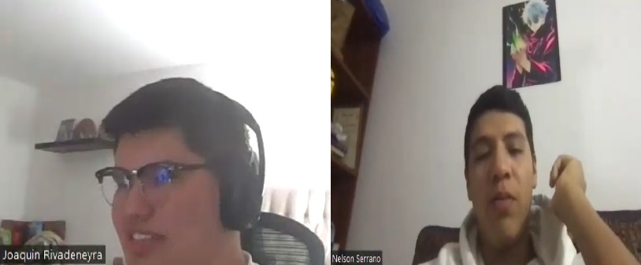
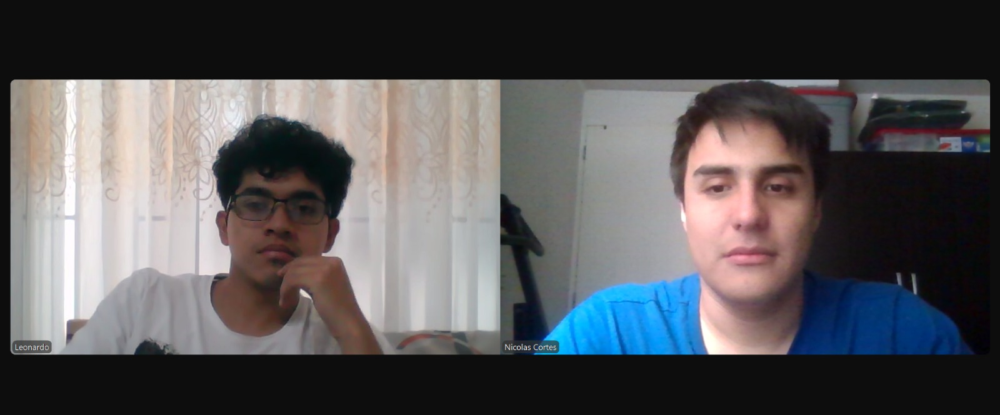

## **Capítulo II: Requirements Elicitation & Analysis**

### **2.1. Competidores**

1. **Bigbelly**  
   Bigbelly es un sistema inteligente de gestión de residuos urbanos que utiliza contenedores solares equipados con sensores IoT para monitorear el nivel de llenado y optimizar las rutas de recolección.

   

     
   

2. **Enevo**  
   Enevo es una plataforma que utiliza sensores inteligentes y tecnología de análisis de datos para optimizar la gestión de residuos, monitoreando el nivel de llenado de los contenedores y mejorando la sostenibilidad.

   

     
   

3. **Sensoneo**  
   Sensoneo ofrece una solución de gestión de residuos basada en sensores IoT que permite monitorear los contenedores de residuos en tiempo real, proporcionando datos valiosos para optimizar las rutas de recolección, reducir costos y mejorar la eficiencia de los servicios de recolección.

   

     
   

### **2.1.1. Análisis Competitivo**

### **WasteTrack**  
**WasteTrack** se diferencia de los competidores internacionales como Bigbelly, Enevo y Sensoneo al estar **totalmente adaptado a las necesidades de las municipalidades peruanas**. A diferencia de otras plataformas, WasteTrack está diseñada específicamente para optimizar los procesos de recolección de residuos en Perú, donde las condiciones urbanas, el tráfico y la gestión de residuos tienen características únicas que requieren soluciones personalizadas.

**Diferenciación y Valor Extra:**
- **Adaptación Local**: WasteTrack está adaptado a las particularidades de Perú, considerando la infraestructura urbana y las necesidades de los municipios locales. Mientras que competidores como **Bigbelly** y **Sensoneo** ofrecen soluciones globales, **WasteTrack** está completamente alineada con la realidad operativa de las municipalidades peruanas, lo que lo convierte en una opción más accesible y eficaz para las autoridades locales.
- **Interfaz de Participación Ciudadana**: A diferencia de otros competidores, **WasteTrack** permite a los ciudadanos seguir el recorrido de los camiones recolectores en tiempo real y participar activamente en la gestión de residuos. Esta interacción ciudadana es clave para mejorar la transparencia y la sostenibilidad del servicio.
- **Costo Asequible y Escalable**: **WasteTrack** ofrece una solución más económica y escalable, ideal para las municipalidades con presupuestos ajustados, lo que lo hace accesible en un mercado que a menudo enfrenta limitaciones de recursos.
- **Optimización Local de Rutas**: **WasteTrack** optimiza las rutas de recolección teniendo en cuenta factores locales como el tráfico, la disposición geográfica de los contenedores y las prioridades de las municipalidades, lo que mejora la eficiencia operativa de manera más precisa que los competidores globales.

   

     
   

<table>
<tr><th colspan="16" valign="top"><b>Competitive Analysis Landscape</b></th></tr>
<tr><td colspan="9" valign="top">¿Por qué llevar a cabo este análisis?</td><td colspan="7" valign="top">Este análisis se lleva a cabo para investigar, analizar y comparar el comportamiento de los competidores directos o indirectos en el mercado de gestión de residuos urbanos y optimización de rutas de recolección. Bigbelly destaca por su enfoque en la sostenibilidad mediante el uso de contenedores solares inteligentes.</td></tr>
<tr><td colspan="6" valign="top"><b>Nombre</b></td><td colspan="3" valign="top"><b>Bigbelly</b></td><td colspan="3" valign="top"><b>Enevo</b></td><td colspan="3" valign="top"><b>Sensoneo</b></td><td valign="top"><b>WasteTrack</b></td></tr>
<tr><td colspan="6" valign="top"><b>Logo</b></td><td colspan="3" valign="top"></td><td colspan="3" valign="top"></td><td colspan="3" valign="top"></td><td valign="top"></td></tr>
<tr><td colspan="3" rowspan="4" valign="top"><b>Perfil</b></td><td colspan="3" rowspan="2" valign="top"><b>Overview</b></td><td colspan="3" rowspan="2" valign="top">Plataforma inteligente de gestión de residuos urbanos que utiliza contenedores solares equipados con sensores IoT para monitorear el nivel de llenado y optimizar las rutas de recolección.</td><td colspan="3" rowspan="2" valign="top">Enevo utiliza sensores IoT para optimizar la gestión de residuos, generando rutas más eficientes y reduciendo costos mediante análisis de datos.</td><td colspan="3" rowspan="2" valign="top">Sensoneo ofrece una solución avanzada con sensores IoT, proporcionando monitoreo en tiempo real y análisis predictivo para optimizar las rutas de recolección.</td><td rowspan="2" valign="top">WasteTrack es la única plataforma adaptada a las necesidades de las municipalidades peruanas, optimizando las rutas de recolección y mejorando la participación ciudadana mediante una plataforma fácil de usar.</td></tr>
<tr></tr>
<tr><td colspan="3" rowspan="2" valign="top"><b>Ventaja competitiva ¿Qué valor ofrece a los clientes?</b></td><td colspan="3" rowspan="2" valign="top">Utiliza contenedores solares inteligentes para monitorear el nivel de llenado y optimizar rutas de recolección.</td><td colspan="3" rowspan="2" valign="top">Enfoque integral para optimización de rutas con análisis predictivos y monitoreo en tiempo real.</td><td colspan="3" rowspan="2" valign="top">Capacidad avanzada de análisis y monitoreo en tiempo real para mejorar la eficiencia operativa.</td><td rowspan="2" valign="top">WasteTrack ofrece la mejor solución para las municipalidades peruanas, con integración de sensores IoT adaptados a las necesidades locales y una interfaz ciudadana que mejora la participación y la transparencia.</td></tr>
<tr></tr>
<tr><td colspan="3" rowspan="2" valign="top"><b>Perfil de Marketing</b></td><td colspan="3" valign="top"><b>Mercado objetivo</b></td><td colspan="3" valign="top">Gobiernos locales y empresas de gestión de residuos que buscan una solución eficiente para la recolección.</td><td colspan="3" valign="top">Municipalidades y empresas interesadas en la optimización de rutas y gestión de residuos mediante IoT.</td><td colspan="3" valign="top">Gobiernos locales y empresas que buscan mejorar la eficiencia operativa y reducir costos en la recolección de residuos urbanos.</td><td valign="top">Municipalidades peruanas y ciudadanos interesados en mejorar la recolección de residuos, reduciendo costos y optimizando rutas de forma transparente.</td></tr>
<tr><td colspan="3" valign="top"><b>Estrategias de Marketing</b></td><td colspan="3" valign="top">
Marketing digital, colaboraciones con gobiernos locales, presencia en eventos sostenibles.
</td><td colspan="3" valign="top">
Alianzas estratégicas con municipalidades, marketing digital, y presencia en eventos de sostenibilidad.
</td><td colspan="3" valign="top">
Marketing a través de asociaciones con gobiernos locales, demostraciones de eficiencia en la gestión de residuos.
</td><td valign="top">
WasteTrack se enfoca en marketing digital local, colaboraciones con autoridades municipales y programas de concientización ciudadana.
</td></tr>
<tr><td colspan="3" rowspan="3" valign="top"><b>Perfil de producto</b></td><td colspan="3" valign="top"><b>Productos y Servicios</b></td><td colspan="3" valign="top">Contenedores solares con sensores IoT, plataforma de optimización de rutas, informes en tiempo real.</td><td colspan="3" valign="top">Plataforma de sensores IoT, software de optimización de rutas, herramientas de análisis de datos.</td><td colspan="3" valign="top">Plataforma de monitoreo IoT, optimización de rutas en tiempo real, análisis predictivo para la recolección de residuos.</td><td valign="top">WasteTrack ofrece una plataforma web con monitoreo en tiempo real, optimización avanzada de rutas y participación ciudadana activa.</td></tr>
<tr><td colspan="3" valign="top"><b>Precios y Costos</b></td><td colspan="3" valign="top">Varía según el número de contenedores instalados y los servicios adicionales de monitoreo.</td><td colspan="3" valign="top">Precios según el número de sensores y la personalización de la plataforma.</td><td colspan="3" valign="top">Precios basados en los sensores IoT y la integración con otros sistemas de gestión de residuos.</td><td valign="top">WasteTrack es una opción más económica y accesible para las municipalidades peruanas, con un modelo escalable que permite reducir costos operativos de manera significativa.</td></tr>
<tr><td colspan="3" valign="top"><b>Canales de distribución</b></td><td colspan="3" valign="top">
- Sucursales físicas, acuerdos con municipalidades.
</td><td colspan="3" valign="top">
- Alianzas estratégicas, acuerdos gubernamentales.
</td><td colspan="3" valign="top">
- Distribución a través de asociaciones gubernamentales, venta directa a través de la web.
</td><td valign="top">
- Distribución a través de asociaciones municipales locales, acuerdos directos con gobiernos y plataformas web.
</td></tr>
<tr><td colspan="3" rowspan="4" valign="top"><b>Análisis FODA</b></td><td colspan="3" valign="top"><b>Fortalezas</b></td><td colspan="3" valign="top">
- Sensores solares inteligentes, optimización de rutas, datos en tiempo real.
</td><td colspan="3" valign="top">
- Optimización de rutas, soluciones de análisis predictivo, monitoreo en tiempo real.
</td><td colspan="3" valign="top">
- Monitoreo avanzado, optimización de rutas en tiempo real.
</td><td valign="top">
- Solución completamente adaptada al contexto peruano, optimización avanzada de rutas, participación ciudadana activa.
</td></tr>
<tr><td colspan="3" valign="top"><b>Debilidades</b></td><td colspan="3" valign="top">
- Dependencia de infraestructura solar, costos iniciales elevados.
</td><td colspan="3" valign="top">
- Necesidad de infraestructura adicional, dependencia de la conectividad.
</td><td colspan="3" valign="top">
- Dependencia de la calidad de sensores, algunos costos adicionales de instalación.
</td><td valign="top">
- Enfoque específico en el mercado peruano, con menor presencia internacional.
</td></tr>
<tr><td colspan="3" valign="top"><b>Oportunidades</b></td><td colspan="3" valign="top">
- Expansión global, alianzas con gobiernos locales.
</td><td colspan="3" valign="top">
- Expansión en mercados emergentes, mejoras tecnológicas.
</td><td colspan="3" valign="top">
- Expansión en nuevos mercados y ciudades, innovación tecnológica.
</td><td valign="top">
- Expansión a nivel nacional en Perú, concientización y participación ciudadana.
</td></tr>
<tr><td colspan="3" valign="top"><b>Amenazas</b></td><td colspan="3" valign="top">
- Competencia en soluciones económicas, cambios regulatorios.
</td><td colspan="3" valign="top">
- Competencia de soluciones más baratas, cambios regulatorios.
</td><td colspan="3" valign="top">
- Competencia en plataformas similares, cambios en regulaciones públicas.
</td><td valign="top">
- Competencia de soluciones internacionales, necesidad de educar al mercado local.
</td></tr>
</table>

### **2.1.2. Estrategias y Tácticas Frente a Competidores**

Hemos empleado un análisis FODA para identificar las oportunidades y desafíos en el mercado de gestión de residuos urbanos, así como para evaluar nuestras fortalezas y debilidades internas. Esta metodología nos ha permitido concebir estrategias y tácticas que se ajusten de manera coherente a nuestro entorno y a los recursos disponibles.

**Estrategia de Distinción:**

Para destacar en el mercado de gestión de residuos, hemos decidido implementar un enfoque centrado en la eficiencia operativa y la participación ciudadana. Esto incluye la optimización en tiempo real de las rutas de recolección de residuos a través de nuestra plataforma web, la integración de sensores IoT para monitorear el nivel de llenado de los contenedores y la oferta de información clara y accesible sobre el estado de la recolección. Además, ofreceremos una interfaz intuitiva que permita a los ciudadanos seguir el recorrido de los camiones recolectores en tiempo real, promoviendo la transparencia y la colaboración. Como parte de nuestra oferta diferenciada, **WasteTrack** permitirá a los municipios gestionar de manera más eficiente sus servicios de recolección, reducir costos operativos y mejorar la sostenibilidad de la ciudad. También planeamos implementar un sistema de notificaciones y alertas para mantener a los ciudadanos informados sobre el estado de la recolección.

**Estrategia de Liderazgo en Costos:**

Nos enfocaremos en optimizar nuestros costos operativos mediante la implementación de soluciones tecnológicas de vanguardia que permitan una gestión más eficiente de los contenedores y rutas. Esto implicará la adopción de sensores IoT asequibles, la optimización de la logística mediante algoritmos avanzados y la automatización de los procesos de recolección y seguimiento. Al reducir costos, **WasteTrack** podrá ofrecer tarifas competitivas y una plataforma accesible para los municipios, permitiendo que estos optimicen sus servicios sin sacrificar la calidad. Esto atraerá tanto a municipios con presupuestos ajustados como a aquellos que buscan mejorar sus servicios a un costo razonable.

**Estrategia de Mercadotecnia:**

Implementaremos una campaña de marketing digital enfocada en aumentar la visibilidad de nuestra plataforma entre los municipios y ciudadanos interesados en mejorar la gestión de residuos urbanos. Nuestras estrategias incluirán publicidad dirigida en plataformas como Google Ads, LinkedIn y Facebook, donde nos enfocaremos en captar la atención de autoridades locales, empresas de gestión de residuos y ciudadanos interesados en la sostenibilidad. Además, planeamos colaborar con asociaciones y organismos gubernamentales relacionados con el medio ambiente para promover **WasteTrack** como una solución innovadora y eficaz para la gestión de residuos. También lanzaremos promociones, como descuentos o servicios adicionales para municipios que adopten la plataforma en su primera implementación.

**Tácticas:**

Nuestras tácticas incluyen la realización de investigaciones de mercado continuas para identificar las necesidades no satisfechas en la gestión de residuos urbanos. Esta investigación nos permitirá ajustar nuestra plataforma para satisfacer de manera más efectiva las demandas de los municipios y ciudadanos, asegurando que **WasteTrack** se mantenga competitivo y relevante. Además, planeamos realizar pruebas A/B para optimizar nuestras campañas publicitarias y ajustar nuestras ofertas en función de la respuesta del mercado. Esto, junto con un enfoque continuo en la experiencia del usuario y la facilidad de uso de nuestra plataforma, nos permitirá diferenciar **WasteTrack** de otros competidores y brindar un servicio que supere las expectativas tanto de los municipios como de los ciudadanos.

### **2.2. Entrevistas**

### **2.2.1. Diseño de entrevistas**

### **Segmento 1: Municipalidades**

1. **¿Podrías contarnos un poco sobre cómo gestionan la recolección de residuos en su municipio?**
2. **¿Qué tipo de tecnologías utilizan actualmente para gestionar la recolección de residuos?**
3. **¿Cuáles son los principales desafíos que enfrentan en la planificación de las rutas de recolección de residuos?**
4. **¿Cómo deciden la frecuencia de recolección en diferentes zonas de la ciudad?**
5. **¿Cuáles son los factores más importantes que consideran al planificar las rutas de recolección?**
6. **¿Tienen alguna herramienta para monitorear el nivel de llenado de los contenedores?**
7. **¿Cómo gestionan los desbordamientos de residuos o retrasos en la recolección?**
8. **¿Qué tan importante es para usted que los ciudadanos puedan seguir el recorrido de los camiones recolectores?**
9. **¿Cómo gestionan las quejas y reclamos de los ciudadanos relacionados con la recolección de residuos?**
10. **¿Consideran que una plataforma digital que permita la optimización de rutas y monitoreo de contenedores podría mejorar la eficiencia del servicio?**
11. **¿Qué tipo de información necesitarían para optimizar el proceso de recolección de residuos?**
12. **¿Están abiertos a implementar soluciones basadas en IoT para mejorar la gestión de residuos urbanos?**
13. **¿Qué desafíos enfrentan en términos de la participación ciudadana en la gestión de residuos?**
14. **¿Cuáles son los principales beneficios que esperan obtener al mejorar la gestión de residuos en su municipio?**
15. **¿Cómo miden actualmente la eficiencia del servicio de recolección de residuos?**
16. **¿Cómo coordinan la recolección de residuos en eventos especiales o días festivos?**
17. **¿Qué tan importante es para ustedes la transparencia en el proceso de recolección de residuos?**
18. **¿Qué características adicionales le gustaría ver en una plataforma para la gestión de residuos urbanos?**
19. **¿Estaría dispuesto a adoptar una solución que permita integrar tanto la optimización de rutas como la participación ciudadana?**
20. **¿Qué tipo de soporte al cliente esperaría recibir al implementar una plataforma de gestión de residuos urbanos?**

---

### **Segmento 2: Ciudadanos**

1. **¿Cómo te informas actualmente sobre los horarios de recolección de residuos en tu zona?**
2. **¿Qué problemas has experimentado al disponer de tus residuos?**
3. **¿Con qué frecuencia tienes dificultades para encontrar un contenedor de residuos adecuado en tu área?**
4. **¿Cómo te gustaría seguir el recorrido del camión recolector en tu zona?**
5. **¿Qué tan importante sería para ti recibir notificaciones sobre el estado de los contenedores de residuos?**
6. **¿Te gustaría saber en tiempo real si un contenedor está lleno antes de disponerte a dejar tu basura?**
7. **¿Qué tan importante es para ti la posibilidad de seguir el camión recolector en tiempo real?**
8. **¿Qué tan fácil es para ti disponer adecuadamente de los residuos según los horarios y zonas de recolección?**
9. **¿Consideras útil recibir información sobre las rutas de recolección de residuos y horarios de paso del camión?**
10. **¿Cómo prefieres recibir información sobre el servicio de recolección de residuos (por ejemplo, notificaciones en una app, mensajes de texto, etc.)?**
11. **¿Qué tan satisfecho estás con el servicio de recolección de residuos en tu área?**
12. **¿Qué sugerencias tienes para mejorar la experiencia de recolección de residuos en tu comunidad?**
13. **¿Te gustaría participar más activamente en la gestión de residuos urbanos? ¿De qué forma?**
14. **¿Te resultaría útil tener acceso a una plataforma que te permita ver el estado de los contenedores y la ruta del camión recolector?**
15. **¿Qué tan probable sería que recomendaras un servicio como WasteTrack a otros ciudadanos para mejorar la recolección de residuos?**
16. **¿Qué características adicionales te gustaría ver en una plataforma que ayude a gestionar los residuos urbanos?**
17. **¿Qué tan importante es para ti la transparencia en el proceso de recolección de residuos en tu zona?**
18. **¿Has tenido alguna mala experiencia al disponer de tus residuos o al no poder acceder al servicio de recolección?**
19. **¿Qué tipo de asistencia al cliente esperas si tuvieses algún problema con la recolección de residuos?**
20. **¿Qué función crees que mejoraría más tu experiencia como ciudadano en un sistema de gestión de residuos urbanos?**

## 2.2.2. Registro de entrevistas

### Municipalidades:

Entrevistado #1: 

Nelson Serrano

●	Sexo: Masculino

●	Edad: 21 años

●	Distrito en el que vive: Surco

●	Nivel socioeconómico: Clase B
Entrevista:

●	Link: [Click para ver entrevista](https://drive.google.com/file/d/1xfp88xcLjj6Mrp3IOyHWl4fSg7WGsBDU/view?usp=sharing)

●	Momento en el que inicia: 0:00

●	Duración: 5:03

●	Entrevistador: Rivadeneyra Ramos, Joaquin David

Resumen:

Nelson Serrano trabaja en la Municipalidad de San Isidro, donde gestiona la recolección de residuos urbanos. En su día a día, utiliza herramientas tecnológicas para mejorar la eficiencia en el servicio y está enfocado en la optimización de rutas y la reducción de costos operativos. Valora la implementación de plataformas que ofrezcan monitoreo en tiempo real de los contenedores mediante sensores IoT y optimización de rutas de recolección, lo que facilita la toma de decisiones informadas. Considera crucial la posibilidad de recibir alertas y notificaciones para mantener el control del proceso de recolección. Aunque ha enfrentado desafíos con la saturación de los contenedores y el desbordamiento de residuos, ve en WasteTrack una solución clave para mejorar la eficiencia, reducir costos y aumentar la transparencia en la gestión de residuos.

Entrevistado #2:

Nombre: Leonardo Soto Tagle

●	Sexo: Masculino

●	Edad: 22 años

●	Distrito en el que vive: San Miguel

Entrevista:

●	Link: [Click para ver entrevista](https://youtu.be/TDk6NwubPeU)

●	Momento en el que inicia: 0:00

●	Duración: 7:08

Resumen:

Leonardo trabaja en la municipalidad de San Miguel, se encarga del monitoreo de los camiones de basura y las operaciones que estos realizan durante las jornadas. Durante sus jornadas regulares, hace uso de herramientas de seguimiento y bases de datos para monitorear los camiones, los desperdicios que estos recogen, y otros parametros adicionales, para asi poder emitir reportes al final del dia con respecto al desempeño diario de cada una de las unidades. Nos indica que valoraria la implementacion de una tecnologia que permita hacer un seguimiento mucho mas detallado a los camiones, para asi determinar si alguno se esta llenando mas de lo debido, ademas, afirma que establecer rutas segun la disposicion del trafico en lugar de rutas predefinidas ayudaria considerablemente a la hora de optimizar los tiempos en los que los camiones opera de forma regular.

Entrevistado #3

  

●	Nombre: Jacqueline Samanez

●	Edad: 53

●	Sexo: Femenino

●	Residencia: Lima - Pueblo Libre

●	Entrevista:

●	Link: [Click para ver entrevista](https://upcedupe-my.sharepoint.com/:v:/g/personal/u202118315_upc_edu_pe/ERge36l0G5lAgx48cxEK3cAB5E-irHI-V5akPQDUYP6NdA?e=babxer&nav=eyJyZWZlcnJhbEluZm8iOnsicmVmZXJyYWxBcHAiOiJTdHJlYW1XZWJBcHAiLCJyZWZlcnJhbFZpZXciOiJTaGFyZURpYWxvZy1MaW5rIiwicmVmZXJyYWxBcHBQbGF0Zm9ybSI6IldlYiIsInJlZmVycmFsTW9kZSI6InZpZXcifX0%3D)

●	Momento en el que inicia: 

●	Duración: 4:30 min

●	Entrevistador: Diaz Villacrez, Maria Alejandra

Resumen:

La entrevistada nos comenta que la municipalidad opera con 5 camiones recolectores siguiendo rutas preestablecidas por zonas, con programación semanal fija. Utilizan tecnologías básicas como GPS en camiones y un software simple de programación de rutas. Ella expresó disposición para adoptar soluciones IoT, siempre que la inversión sea justificable con resultados concretos. Enfatizó la importancia de la transparencia en el servicio y la necesidad de herramientas analíticas predictivas que faciliten la toma de decisiones rápidas.

### Ciudadanos:
Entrevistada #1: Sebastian Palacios

<ul>
    <li>
        Sexo: Masculino
    </li>
    <li>
        Edad: 27 años
    </li>
    <li>
        Distrito en el que vive: San Borja
    </li>
    <li>
        Nivel socioeconómico: Clase B
    </li>
</ul>
Entrevista:
<ul>
    <li>
        Link: <a href="https://youtu.be/6Al_sL4MM2g">Click para ver entrevista</a>
    </li>
    <li>
        Momento en el que inicia: 0:00
    </li>
    <li>
        Duración: 08:47
    </li>
      <li>
        Entrevistador: Espinoza Saenz, Christian Renato
    </li>
</ul>

Resumen:

    Entrevistamos a Sebastian Palacios, de 27 años,administrador de un taller de autos que enfrenta diversos desafíos en la gestión de su flota. Sebastián se ocupa de mantener los vehículos en óptimas condiciones mientras maneja la demanda fluctuante y la distribución eficiente de la flota. Sebastian menciona que sus principales canales de adquisición de clientes incluyen el marketing digital y asociaciones locales.Además destaca la importancia de la reputación y ofrece programas de fidelidad para clientes habituales.También enfrenta desafíos al expandir su negocio a nuevas ubicaciones, incluyendo la adaptación a nuevos mercados y la gestión de la logística de expansión.

Entrevistado #2: 

Diego Cantoral

 
●	Sexo: Masculino

●	Edad: 22 años

●	Distrito en el que vive: Pueblo Libre

Entrevista:

●	Link: 

●	Momento en el que inicia: 

●	Duración: 

●	Entrevistador: Valverde Lopez, Josue Daniel

Resumen:

Diego es un joven ciudadano del distrito de Pueblo Libre, quien nos comenta su experiencia con el servicio de recolección de residuos en su zona e indica que pocas veces falla el servicio de recolección. Sin embargo, ante esas situaciones no sabe como prevenir la acumulación de residuos. Se muestra de acuerdo con una plataforma la cual lo ayude con la visualización y alertas antes de que ocurra una acumulación de residuos.

Entrevistado #3:

Leandro Medina

●	Sexo: Masculino

●	Edad: 22 años

●	Distrito en el que vive: Lima

●	Nivel socioeconómico: Clase A

Entrevista:

●	Link: [Click para ver entrevista](https://www.youtube.com/watch?v=_RbKISOL-Qo)

●	Momento en el que inicia: 0:12

●	Duración: 4:58 

●	Entrevistador: Serrano Ircañaupa, Nelson Elías

Resumen:

Leandro nos dio a conocer su opinion de algunas de las preguntas planteadas por su conocimiento de estar relacionado con este tipo de empresarios de alquiler. Nos contó que los principales desafíos al administrar una flota de vehículos incluyen el mantenimiento regular, la gestión de reparaciones, la optimización de la rotación para maximizar la rentabilidad, y la actualización de los vehículos para cumplir con normativas y preferencias del cliente. Además mencionó que la rentabilidad de un vehículo se determina según su tasa de utilización, costos de mantenimiento, ingresos generados, y depreciación.

### **2.2.3. Análisis de Entrevistas**

Según las entrevistas realizadas y los resúmenes, hemos llevado a cabo un análisis de las entrevistas en el que destacamos las similitudes y hallazgos:

### **Segmento Objetivo #1: Municipalidades**

    Durante las entrevistas con los representantes de las municipalidades, se identificó que buscan principalmente mejorar la eficiencia operativa en la gestión de residuos urbanos. Expresaron un fuerte deseo de contar con una plataforma que les permita optimizar las rutas de recolección de residuos en tiempo real, con la capacidad de monitorear el nivel de llenado de los contenedores mediante sensores IoT. Además, valoran la posibilidad de obtener datos precisos para la planificación y la toma de decisiones, así como mejorar la participación ciudadana al ofrecerles información sobre el recorrido de los camiones recolectores. La facilidad para gestionar los horarios, las rutas y la capacidad de adaptación a cambios imprevistos (por ejemplo, eventos o días festivos) son aspectos cruciales para ellos. En resumen, las municipalidades buscan una plataforma que facilite la gestión de residuos, optimice las rutas de recolección y brinde visibilidad tanto a los operadores como a los ciudadanos.

### **Segmento Objetivo #2: Ciudadanos**

    Las entrevistas con los ciudadanos revelaron que buscan principalmente un proceso de disposición de residuos más eficiente y transparente. Expresaron un fuerte interés en poder seguir el recorrido de los camiones recolectores en tiempo real a través de una plataforma móvil, y recibir notificaciones sobre los horarios y el estado de los contenedores en su zona. También valoran la posibilidad de disponer sus residuos de manera adecuada y oportuna, evitando la saturación de los contenedores. La participación activa en la gestión de residuos, a través de la notificación de contenedores llenos o la visualización de información relacionada con la recolección, es importante para ellos. En resumen, los ciudadanos buscan una plataforma que les brinde mayor control sobre el proceso de disposición de residuos, aumente la transparencia en el servicio y facilite la interacción con los servicios de recolección.

### 2.3. Needfinding

### 2.3.1. User Personas

   <strong>Segmento 1:</strong> Ciudadanos que desean conocer el recorrido del camión recolector y contribuir al orden urbano

Luis Ramírez es un ingeniero ambiental de 45 años que trabaja en la Municipalidad de Trujillo, Perú. Está a cargo de la gestión del servicio de limpieza pública y se enfrenta constantemente a desafíos como la sobrecarga de contenedores, rutas ineficientes y quejas vecinales. Aunque tiene experiencia en planificación logística, sus decisiones suelen depender de reportes manuales y supervisiones presenciales. Está muy interesado en adoptar herramientas tecnológicas que automaticen la recolección de datos y optimicen las rutas de recolección de basura. Utiliza su laptop y smartphone para gestionar informes y coordinar con su equipo, y suele consultar LinkedIn para conocer tendencias sobre ciudades inteligentes y sostenibilidad urbana.

 </img>     

   <strong>Segmento 2:</strong> Funcionarios de municipalidades encargados de limpieza urbana

Valeria Torres es una madre de familia de 29 años que vive en un barrio residencial de Arequipa, Perú. Se preocupa por la limpieza de su entorno y por educar a sus hijos en prácticas responsables con el medio ambiente. Suele organizar sus actividades del hogar y la disposición de residuos según el horario del camión recolector, pero frecuentemente se ve afectada por demoras o cambios inesperados. Utiliza su celular para comunicarse por WhatsApp, navegar en redes sociales y acceder a aplicaciones útiles. Está interesada en herramientas que le permitan saber exactamente cuándo pasarán a recoger la basura para evitar que se acumule en la vía pública. Sigue cuentas de sostenibilidad y orden urbano en Instagram y TikTok.

 </img>    

### 2.3.2. User Task Matrix.

El User Task Matrix presenta las tareas más comunes que realizan Luis Ramírez y Valeria Torres en relación con la gestión del sistema de recolección de residuos urbanos. Para Luis, destacan la supervisión del sistema, la planificación de rutas y la atención a incidencias. En el caso de Valeria, las tareas más frecuentes giran en torno a conocer el horario del camión recolector y disponer adecuadamente los residuos. Este análisis revela cómo ambas partes participan en el sistema desde roles complementarios.

<body>
    <h2>User Task Matrix</h2>
    <table border="0" cellspacing="0" cellpadding="8">
        <tr>
            <th rowspan="2">User Task</th>
            <th colspan="2">Luis Ramírez</th>
            <th colspan="2">Valeria Torres</th>
        </tr>
        <tr>
            <th>Frecuencia</th>
            <th>Importancia</th>
            <th>Frecuencia</th>
            <th>Importancia</th>
        </tr>
        <tr>
            <td>Supervisar niveles de llenado de contenedores</td>
            <td>SIEMPRE</td>
            <td>ALTA</td>
            <td>NUNCA</td>
            <td>BAJA</td>
        </tr>
        <tr>
            <td>Planificar rutas de recolección</td>
            <td>USUALMENTE</td>
            <td>ALTA</td>
            <td>NUNCA</td>
            <td>BAJA</td>
        </tr>
        <tr>
            <td>Atender reportes e incidencias de vecinos</td>
            <td>USUALMENTE</td>
            <td>MEDIA</td>
            <td>OCASIONALMENTE</td>
            <td>ALTA</td>
        </tr>
        <tr>
            <td>Visualizar el recorrido estimado del camión recolector</td>
            <td>OCASIONALMENTE</td>
            <td>MEDIA</td>
            <td>SIEMPRE</td>
            <td>ALTA</td>
        </tr>
        <tr>
            <td>Disponer residuos según horario del camión recolector</td>
            <td>RARAMENTE</td>
            <td>MEDIA</td>
            <td>SIEMPRE</td>
            <td>ALTA</td>
        </tr>
        <tr>
            <td>Consultar información sobre sostenibilidad y limpieza urbana</td>
            <td>OCASIONALMENTE</td>
            <td>MEDIA</td>
            <td>USUALMENTE</td>
            <td>MEDIA</td>
        </tr>
    </table>
</body>

### 2.3.3. User Journey Mapping.

<strong>User Persona:</strong> Luis Ramirez

El User Journey Mapping de Luis Ramírez resalta los desafíos operativos y estratégicos que enfrenta como encargado del servicio de limpieza pública en la municipalidad. A lo largo del proceso, Luis experimenta una carga significativa debido a la falta de información en tiempo real y herramientas inteligentes para optimizar rutas. Estas limitaciones generan retrasos, ineficiencias y constantes quejas vecinales. La incorporación de un sistema automatizado basado en sensores IoT representa una solución clave para mejorar su toma de decisiones, reducir costos y elevar la percepción ciudadana.

 </img>    

<strong>User Persona:</strong> Valeria Torres

El User Journey Mapping de Valeria Torres destaca las situaciones que enfrenta en su rutina diaria para disponer correctamente sus residuos. Valeria experimenta incertidumbre y frustración cuando no sabe con exactitud a qué hora pasará el camión recolector. Esto afecta su organización familiar y genera malestar por la acumulación de basura en la vía pública. La incorporación de una interfaz ciudadana que muestre en tiempo real el recorrido del camión y brinde alertas puede mejorar significativamente su experiencia y fomentar su compromiso con el cuidado del entorno urbano.

 </img>    

### 2.3.4. As-is Scenario Mapping.

<strong>User Persona:</strong> Luis Ramirez

Este mapa describe el flujo actual del trabajo de Luis Ramírez como responsable del área de limpieza pública en una municipalidad. Desde la identificación de problemas hasta la entrega de informes, Luis debe revisar reportes, atender quejas vecinales, coordinar con su equipo operativo y tomar decisiones basadas en datos que muchas veces están incompletos o desactualizados. Sus pensamientos se centran en optimizar procesos y reducir quejas, mientras que sus emociones varían entre frustración por la ineficiencia del sistema actual y satisfacción cuando logra implementar mejoras tangibles.

 </img>    

<strong>User Persona:</strong> Valeria Torres

Este mapa representa el flujo actual de actividades de Valeria Torres como ciudadana preocupada por el orden y la limpieza en su barrio. A lo largo del día, Valeria organiza la disposición de residuos en su hogar, consulta con vecinos sobre el horario del camión recolector, y enfrenta frustraciones cuando la información no es clara o los residuos no son recogidos a tiempo. Sus pensamientos giran en torno a mantener su hogar y vecindario limpio, mientras que sus emociones fluctúan entre satisfacción cuando todo está en orden y molestia cuando el camión no llega como esperaba.

 </img>    

## 2.4. Ubiquitous Language.

<table border="0" cellspacing="0" cellpadding="8">
    <thead>
        <tr>
            <th>Término</th>
            <th>Definición</th>
        </tr>
    </thead>
    <tbody>
        <tr>
            <td>Smart Bin</td>
            <td>Contenedor de residuos equipado con sensores IoT que miden el nivel de llenado en tiempo real.</td>
        </tr>
        <tr>
            <td>Fill Level</td>
            <td>Porcentaje de capacidad ocupada en un contenedor de basura.</td>
        </tr>
        <tr>
            <td>Collection Route</td>
            <td>Ruta planificada que sigue el camión recolector para recoger los residuos urbanos.</td>
        </tr>
        <tr>
            <td>Route Optimization</td>
            <td>Proceso de cálculo automático de la mejor ruta según nivel de llenado, distancia, prioridad y horario.</td>
        </tr>
        <tr>
            <td>Waste Type</td>
            <td>Categoría del residuo depositado (orgánico, reciclable, no reciclable, peligroso).</td>
        </tr>
        <tr>
            <td>Priority Zone</td>
            <td>Zona geográfica que requiere atención inmediata por alto volumen de residuos o quejas ciudadanas.</td>
        </tr>
        <tr>
            <td>Citizen Interface</td>
            <td>Parte del sistema orientada a los ciudadanos, donde pueden consultar el estado del servicio.</td>
        </tr>
        <tr>
            <td>Alert Notification</td>
            <td>Mensaje enviado a funcionarios o ciudadanos cuando un contenedor supera el umbral de llenado.</td>
        </tr>
        <tr>
            <td>IoT Monitoring</td>
            <td>Supervisión en tiempo real del estado de los contenedores mediante sensores conectados.</td>
        </tr>
        <tr>
            <td>Overflow Risk</td>
            <td>Probabilidad de que un contenedor se desborde antes de ser recolectado.</td>
        </tr>
    </tbody>
</table>

