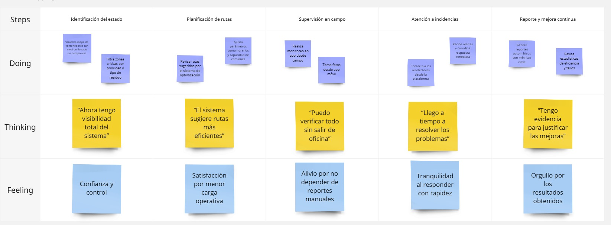
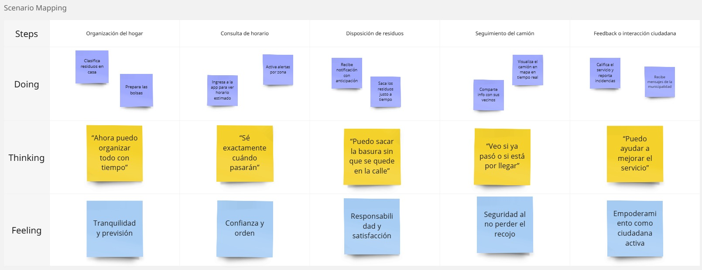
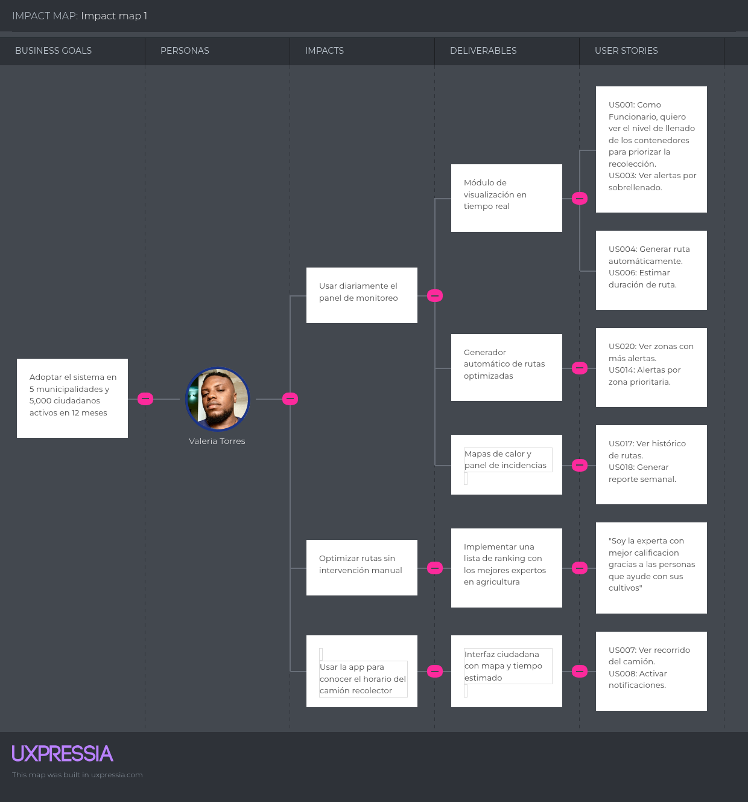

# Capítulo III: Requirements Specification

## 3.1. To-Be Scenario Mapping

<strong>Segmento 1:</strong> Funcionarios de municipalidades (Luis Ramírez)

Este mapa describe cómo sería el nuevo flujo de trabajo de Luis Ramírez tras la implementación del sistema inteligente de gestión de residuos. Gracias a los sensores IoT y la plataforma de visualización en tiempo real, Luis puede acceder a información actualizada sobre el estado de los contenedores, planificar rutas óptimas automáticamente y responder rápidamente a incidentes reportados. Su trabajo se vuelve más estratégico, menos reactivo y con una mayor percepción de control y eficiencia.

 </img>    

<strong>Segmento 2:</strong>  Ciudadanos (Valeria Torres)

Este mapa representa cómo sería la experiencia de Valeria Torres con la nueva plataforma de gestión inteligente de residuos. Con acceso a una interfaz ciudadana que le brinda información en tiempo real sobre el recorrido del camión recolector y alertas anticipadas, Valeria puede organizar mejor la disposición de sus residuos y participar activamente en el cuidado de su entorno. La tecnología reduce su incertidumbre y le permite actuar con mayor seguridad y responsabilidad.

 </img>    

## 3.2. User Stories

En esta sección se detallan las historias de usuario.

<h2>3.2. User Stories</h2>
<table border="0" cellspacing="0" cellpadding="8">
  <thead>
    <tr>
      <th>Epic/Story ID</th>
      <th>Título</th>
      <th>Descripción</th>
      <th>Criterios de Aceptación</th>
      <th>Relacionado con Epic ID</th>
    </tr>
  </thead>
  <tbody>
    <tr>
      <td>EP001</td>
      <td>Visualización del estado de los contenedores</td>
      <td>Como Funcionario, quiero visualizar en un mapa el estado actual de los contenedores para tomar decisiones más eficientes.</td>
      <td></td>
      <td>-</td>
    </tr>
    <tr>
      <td>US001</td>
      <td>Ver nivel de llenado</td>
      <td>Como Funcionario, quiero ver el porcentaje de llenado de cada contenedor para priorizar su recolección.</td>
      <td>Dado que el usuario está en el mapa, cuando hace clic en un contenedor, entonces se muestra su nivel de llenado.</td>
      <td>EP001</td>
    </tr>
    <tr>
      <td>US002</td>
      <td>Filtrar por tipo de residuo</td>
      <td>Como Funcionario, quiero filtrar los contenedores por tipo de residuo para facilitar la planificación.</td>
      <td>Dado que selecciona un filtro, cuando aplica el tipo "orgánico", entonces solo se muestran esos contenedores.</td>
      <td>EP001</td>
    </tr>
    <tr>
      <td>US003</td>
      <td>Ver alertas por sobrellenado</td>
      <td>Como Funcionario, quiero ver qué contenedores superaron el umbral de llenado para actuar rápidamente.</td>
      <td>Dado que un contenedor se llena, cuando supera el 90%, entonces se muestra una alerta visual.</td>
      <td>EP001</td>
    </tr>
    <tr>
      <td>EP002</td>
      <td>Rutas optimizadas</td>
      <td>Como Funcionario, quiero que el sistema genere rutas automáticas según prioridades y llenado.</td>
      <td></td>
      <td>-</td>
    </tr>
    <tr>
      <td>US004</td>
      <td>Generar ruta automáticamente</td>
      <td>Como Funcionario, quiero generar rutas automáticas para camiones recolectores.</td>
      <td>Dado que hay contenedores por recoger, cuando selecciono "generar ruta", entonces se muestra el itinerario optimizado.</td>
      <td>EP002</td>
    </tr>
    <tr>
      <td>US005</td>
      <td>Editar rutas manualmente</td>
      <td>Como Funcionario, quiero poder editar rutas para hacer ajustes según necesidades reales.</td>
      <td>Dado que hay una ruta generada, cuando hago clic en "editar", entonces puedo mover o eliminar paradas.</td>
      <td>EP002</td>
    </tr>
    <tr>
      <td>US006</td>
      <td>Estimar duración de ruta</td>
      <td>Como Funcionario, quiero ver el tiempo estimado por ruta para mejorar la asignación de turnos.</td>
      <td>Dado que una ruta está generada, cuando visualizo detalles, entonces aparece su duración estimada.</td>
      <td>EP002</td>
    </tr>
    <tr>
      <td>EP003</td>
      <td>Seguimiento ciudadano</td>
      <td>Como Ciudadano, quiero ver cuándo pasará el camión recolector para disponer adecuadamente mis residuos.</td>
      <td></td>
      <td>-</td>
    </tr>
    <tr>
      <td>US007</td>
      <td>Ver recorrido del camión</td>
      <td>Como Ciudadano, quiero ver en un mapa la ruta y hora estimada del camión.</td>
      <td>Dado que ingreso al sistema, cuando selecciono mi zona, entonces veo el recorrido y hora estimada.</td>
      <td>EP003</td>
    </tr>
    <tr>
      <td>US008</td>
      <td>Activar notificaciones</td>
      <td>Como Ciudadano, quiero recibir alertas cuando el camión esté cerca.</td>
      <td>Dado que activo las notificaciones, cuando el camión esté a 5 minutos, entonces recibo una alerta.</td>
      <td>EP003</td>
    </tr>
    <tr>
      <td>US009</td>
      <td>Reportar contenedor desbordado</td>
      <td>Como Ciudadano, quiero reportar contenedores desbordados para que la municipalidad actúe.</td>
      <td>Dado que veo un contenedor lleno, cuando hago clic en "reportar", entonces se envía una alerta al sistema.</td>
      <td>EP003</td>
    </tr>
    <tr>
      <td>US010</td>
      <td>Ver información de reciclaje</td>
      <td>Como Ciudadano, quiero consultar qué tipo de residuos van en cada contenedor.</td>
      <td>Dado que selecciono un contenedor, cuando abro sus detalles, entonces veo el tipo de residuo aceptado.</td>
      <td>EP003</td>
    </tr>
    <tr>
      <td>EP004</td>
      <td>Monitoreo automatizado</td>
      <td>Como Administrador, quiero que los sensores envíen datos automáticamente para monitorear el llenado.</td>
      <td></td>
      <td>-</td>
    </tr>
    <tr>
      <td>US011</td>
      <td>Registrar sensores</td>
      <td>Como Técnico, quiero registrar nuevos sensores para que comiencen a enviar datos.</td>
      <td>Dado que ingreso un nuevo sensor, cuando lo asigno a un contenedor, entonces aparece en el sistema.</td>
      <td>EP004</td>
    </tr>
    <tr>
      <td>US012</td>
      <td>Ver último dato recibido</td>
      <td>Como Funcionario, quiero ver la hora del último dato enviado para verificar el funcionamiento del sensor.</td>
      <td>Dado que selecciono un contenedor, cuando veo detalles, entonces se muestra la última hora de actualización.</td>
      <td>EP004</td>
    </tr>
    <tr>
      <td>US013</td>
      <td>Ver estado del sensor</td>
      <td>Como Técnico, quiero saber si un sensor dejó de enviar datos para dar mantenimiento.</td>
      <td>Dado que el sensor no envía datos por más de X tiempo, entonces se marca como "desconectado".</td>
      <td>EP004</td>
    </tr>
    <tr>
      <td>EP005</td>
      <td>Sistema de alertas</td>
      <td>Como Usuario, quiero recibir notificaciones sobre eventos críticos para actuar con rapidez.</td>
      <td></td>
      <td>-</td>
    </tr>
    <tr>
      <td>US014</td>
      <td>Alertas por zona prioritaria</td>
      <td>Como Funcionario, quiero recibir alertas de zonas críticas.</td>
      <td>Dado que una zona tiene varios contenedores llenos, entonces recibo una notificación para priorizarla.</td>
      <td>EP005</td>
    </tr>
    <tr>
      <td>US015</td>
      <td>Alertas por retraso de camión</td>
      <td>Como Ciudadano, quiero saber si hay demoras en la recolección.</td>
      <td>Dado que el camión no ha pasado, cuando se excede el tiempo estimado, entonces se envía una alerta al usuario.</td>
      <td>EP005</td>
    </tr>
    <tr>
      <td>US016</td>
      <td>Configurar preferencias de alerta</td>
      <td>Como Ciudadano, quiero configurar qué tipo de alertas recibir.</td>
      <td>Dado que ingreso a configuración, cuando selecciono mis preferencias, entonces solo recibo las que he activado.</td>
      <td>EP005</td>
    </tr>
    <tr>
      <td>EP006</td>
      <td>Gestión de datos operativos</td>
      <td>Como Administrador, quiero generar reportes sobre rutas, recolección y alertas para tomar decisiones.</td>
      <td></td>
      <td>-</td>
    </tr>
    <tr>
      <td>US017</td>
      <td>Ver histórico de rutas</td>
      <td>Como Funcionario, quiero consultar rutas pasadas para analizar patrones.</td>
      <td>Dado que selecciono un camión, cuando ingreso a su historial, entonces veo las rutas realizadas.</td>
      <td>EP006</td>
    </tr>
    <tr>
      <td>US018</td>
      <td>Generar reporte semanal</td>
      <td>Como Administrador, quiero exportar reportes en PDF para reuniones.</td>
      <td>Dado que selecciono un rango de fechas, cuando hago clic en "exportar", entonces se descarga el archivo.</td>
      <td>EP006</td>
    </tr>
    <tr>
      <td>US019</td>
      <td>Ver cantidad de residuos por tipo</td>
      <td>Como Funcionario, quiero saber cuánto residuo recolectó cada camión según tipo.</td>
      <td>Dado que reviso el reporte, cuando aplico el filtro, entonces se desglosa por tipo de residuo.</td>
      <td>EP006</td>
    </tr>
    <tr>
      <td>US020</td>
      <td>Ver zonas con más alertas</td>
      <td>Como Administrador, quiero identificar zonas con más problemas.</td>
      <td>Dado que abro el dashboard, cuando selecciono "mapa de calor", entonces veo las zonas con más reportes.</td>
      <td>EP006</td>
    </tr>
  </tbody>
</table>

## 3.3. Impact Mapping

Este Impact Mapping se desarrolló con el objetivo de alcanzar el business goal de lograr la adopción del sistema por 5 municipalidades y al menos 5,000 ciudadanos activos en 12 meses. Se identificaron como actores clave al Funcionario Municipal (Luis Ramírez) y a la Ciudadana Responsable (Valeria Torres). A partir de ellos se derivan los impactos deseados, los entregables necesarios y las User Stories que respaldan los objetivos de negocio.

 </img>    

## 3.4. Product Backlog

En esta sección se presenta el backlog del producto.

<table border="0" cellspacing="0" cellpadding="8">
  <thead>
    <tr>
      <th>Orden</th>
      <th>User Story Id</th>
      <th>Título</th>
      <th>Descripción</th>
      <th>Story Points (1 / 2 / 3 / 5 / 8)</th>
    </tr>
  </thead>
  <tbody>
    <tr><td>1</td><td>US001</td><td>Ver nivel de llenado</td><td>Como Funcionario, quiero ver el porcentaje de llenado de cada contenedor para priorizar su recolección.</td><td>2</td></tr>
    <tr><td>2</td><td>US002</td><td>Filtrar por tipo de residuo</td><td>Como Funcionario, quiero filtrar los contenedores por tipo de residuo para facilitar la planificación.</td><td>3</td></tr>
    <tr><td>3</td><td>US003</td><td>Ver alertas por sobrellenado</td><td>Como Funcionario, quiero ver qué contenedores superaron el umbral de llenado para actuar rápidamente.</td><td>2</td></tr>
    <tr><td>4</td><td>US004</td><td>Generar ruta automáticamente</td><td>Como Funcionario, quiero generar rutas automáticas para camiones recolectores.</td><td>5</td></tr>
    <tr><td>5</td><td>US005</td><td>Editar rutas manualmente</td><td>Como Funcionario, quiero poder editar rutas para hacer ajustes según necesidades reales.</td><td>3</td></tr>
    <tr><td>6</td><td>US006</td><td>Estimar duración de ruta</td><td>Como Funcionario, quiero ver el tiempo estimado por ruta para mejorar la asignación de turnos.</td><td>2</td></tr>
    <tr><td>7</td><td>US007</td><td>Ver recorrido del camión</td><td>Como Ciudadano, quiero ver en un mapa la ruta y hora estimada del camión.</td><td>3</td></tr>
    <tr><td>8</td><td>US008</td><td>Activar notificaciones</td><td>Como Ciudadano, quiero recibir alertas cuando el camión esté cerca.</td><td>3</td></tr>
    <tr><td>9</td><td>US009</td><td>Reportar contenedor desbordado</td><td>Como Ciudadano, quiero reportar contenedores desbordados para que la municipalidad actúe.</td><td>2</td></tr>
    <tr><td>10</td><td>US010</td><td>Ver información de reciclaje</td><td>Como Ciudadano, quiero consultar qué tipo de residuos van en cada contenedor.</td><td>2</td></tr>
    <tr><td>11</td><td>US011</td><td>Registrar sensores</td><td>Como Técnico, quiero registrar nuevos sensores para que comiencen a enviar datos.</td><td>3</td></tr>
    <tr><td>12</td><td>US012</td><td>Ver último dato recibido</td><td>Como Funcionario, quiero ver la hora del último dato enviado para verificar el funcionamiento del sensor.</td><td>2</td></tr>
    <tr><td>13</td><td>US013</td><td>Ver estado del sensor</td><td>Como Técnico, quiero saber si un sensor dejó de enviar datos para dar mantenimiento.</td><td>3</td></tr>
    <tr><td>14</td><td>US014</td><td>Alertas por zona prioritaria</td><td>Como Funcionario, quiero recibir alertas de zonas críticas.</td><td>3</td></tr>
    <tr><td>15</td><td>US015</td><td>Alertas por retraso de camión</td><td>Como Ciudadano, quiero saber si hay demoras en la recolección.</td><td>3</td></tr>
    <tr><td>16</td><td>US016</td><td>Configurar preferencias de alerta</td><td>Como Ciudadano, quiero configurar qué tipo de alertas recibir.</td><td>2</td></tr>
    <tr><td>17</td><td>US017</td><td>Ver histórico de rutas</td><td>Como Funcionario, quiero consultar rutas pasadas para analizar patrones.</td><td>5</td></tr>
    <tr><td>18</td><td>US018</td><td>Generar reporte semanal</td><td>Como Administrador, quiero exportar reportes en PDF para reuniones.</td><td>3</td></tr>
    <tr><td>19</td><td>US019</td><td>Ver cantidad de residuos por tipo</td><td>Como Funcionario, quiero saber cuánto residuo recolectó cada camión según tipo.</td><td>2</td></tr>
    <tr><td>20</td><td>US020</td><td>Ver zonas con más alertas</td><td>Como Administrador, quiero identificar zonas con más problemas.</td><td>3</td></tr>
  </tbody>
</table>
