# Capítulo IV: Strategic-Level Software Design

## 4.1. Strategic-Level Attribute-Driven Design

### 4.1.1. Design Purpose

El propósito de diseño de WasteTrack es desarrollar una plataforma interactiva de simulación de rutas de recolección de residuos urbanos que permita generar datos de operación, tales como nivel de llenado de contenedores, tiempos de viaje, condiciones ambientales y de tráfico, horarios y ubicaciones; para, a partir de ellos, entrenar modelos predictivos de algoritmos de optimización de rutas (Dijkstra o Prim), con el fin de mejorar la eficiencia operativa, reducir costos de combustible y emisiones, y garantizar la atención oportuna de los contenedores mas críticos en diversas ciudades o distritos.

### 4.1.2. Attribute-Driven Design Inputs

#### 4.1.2.1. Primary Functionality (Primary User Stories)

En esta sección se identificarán las Epics y User Stories más relevantes en términos de requisitos funcionales que impacten en la arquitectura de la solucion propuesta para la identificación de rutas óptimas para la recolección de residuos urbanos. Las historias listadas a continuación aseguran que la visualizacion del estado de los contenedores, las rutas optimizadas, el seguimiento ciudadano, el monitoro automatizado, el sistema de alertas y la gestión de datos operativos funcionen de manera óptima:

<table border="0" cellspacing="0" cellpadding="8">
  <thead>
    <tr>
      <th>Epic/User Story ID</th>
      <th>Título</th>
      <th>Descripción</th>
      <th>Criterios de Aceptación</th>
      <th>Relacionado con (Epic ID)</th>
    </tr>
  </thead>
  <tbody>
    <tr>
      <td>EP01/US01</td>
      <td>Ver nivel de llenado</td>
      <td>Como Funcionario, quiero ver el procentaje de llenado de cada contenedor para priorizar su       recolección</td>
      <td>Dado que el usuario está en el mapa, cuando hace clic en un contenedor, entonces se muestra su nivel de llenado.</td>
      <td>Visualización del estado de los contenedores (EP01)</td>
    </tr>
    <tr>
      <td>EP01/US03</td>
      <td>Ver alertas por sobrellenado</td>
      <td>Como Funcionario, quiero ver qué contenedores superaron el umbral de llenado para actuar rápidamente.</td>
      <td>Dado que un contenedor se llena, cuando supera el 90%, entonces se muestra una alerta visual.</td>
      <td>Visualización del estado de los contenedores (EP01)</td>
    </tr>
    <tr>
      <td>EP02/US04</td>
      <td>Generar ruta automáticamente</td>
      <td>Como Funcionario, quiero generar rutas automáticas para camiones recolectores.</td>
      <td>Dado que hay contenedores por recoger, cuando selecciono "generar ruta", entonces se muestra el itinerario optimizado.</td>
      <td>Rutas optimizadas (EP02)</td>
    </tr>
    <tr>
      <td>EP02/US06</td>
      <td>Estimar duración de ruta</td>
      <td>Como Funcionario, quiero ver el tiempo estimado por ruta para mejorar la asignación de turnos.</td>
      <td>Dado que una ruta está generada, cuando visualizo detalles, entonces aparece su duración estimada.</td>
      <td>Rutas optimizadas (EP02)</td>
    </tr>
    <tr>
      <td>EP03/US07</td>
      <td>Ver recorrido del camión</td>
      <td>Como Ciudadano, quiero ver en un mapa la ruta y hora estimada del camión.</td>
      <td>Dado que ingreso al sistema, cuando selecciono mi zona, entonces veo el recorrido y hora estimada.</td>
      <td>Seguimiento ciudadano (EP03)</td>
    </tr>
    <tr>
      <td>EP05/US14</td>
      <td>Alertas por zona prioritaria</td>
      <td>Como Funcionario, quiero recibir alertas de zonas críticas.</td>
      <td>Dado que una zona tiene varios contenedores llenos, entonces recibo una notificación para priorizarla.</td>
      <td>Sistema de alertas (EP05)</td>
    </tr>
    <tr>
      <td>EP05/US15</td>
      <td>Alertas por retraso de camión</td>
      <td>Como Ciudadano, quiero saber si hay demoras en la recolección.</td>
      <td>Dado que el camión no ha pasado, cuando se excede el tiempo estimado, entonces se envía una alerta al usuario.</td>
      <td>Sistema de alertas (EP05)</td>
    </tr>
    <tr>
      <td>EP06/US20</td>
      <td>Ver zonas con más alertas</td>
      <td>Como Administrador, quiero identificar zonas con más problemas.</td>
      <td>Dado que abro el dashboard, cuando selecciono "mapa de calor", entonces veo las zonas con más reportes.</td>
      <td>Gestión de datos operativos (EP06)</td>
    </tr>
  </tbody>
</table>

#### 4.1.2.2. Quality attribute Scenarios

<table border="0" cellspacing="0" cellpadding="8">
  <tbody>
    <tr>
      <th>ID</th>
      <th>Atributo de Calidad</th>
      <th>Fuente</th>
      <th>Estímulo</th>
      <th>Artefacto</th>
      <th>Entorno</th>
      <th>Respuesta</th>
      <th>Medida</th>
    </tr>
    <tr>
      <td>AC-01</td>
      <td>Disponibilidad</td>
      <td>Ciudadano / Sistema</td>
      <td>Intento de reporte de un contenedor desbordado en cualquier momento de operación.</td>
      <td>Sistema de reportes de contenedores desbordados</td>
      <td>Zona de recojo de desperdicios</td>
      <td>El sistema debe permitir que los ciudadanos reporten, en cualquier momento del día, aquellos contenedores que se encuentren desbordados de desperdicios para que la municipalidad del distrito en la que estos se ecnuentran residiendo tome medidas.</td>
      <td>El sistema debe garantizar que el ciudadano pueda reportar la existencia de contenedores desbordados a su municipalidad en cualquier momento del día.</td>
    </tr>
    <tr>
      <td>AC-02</td>
      <td>Usabilidad</td>
      <td>Ciudadano</td>
      <td>Seguimiento de la ruta del camión proximo a pasar por la residencia del ciudadano.</td>
      <td>Interfaz del sistema</td>
      <td>Residencia del ciudadano</td>
      <td>El sistema debe poder actualizar la ubicación del camión que esta próximo a pasar por el hogar de un ciudadano en un tiempo no mayor a 5 segundos y debe enviar una notificación al dispositivo móvil de la persona cuando el camión se encuentre a, aproximadamente, 2 minutos de la residencia del mismo.</td>
      <td>El tiempo de actualización de la ubicación del camión no debe exceder los 5 segundos</td>
    </tr>
    <tr>
      <td>AC-03</td>
      <td>Rendimiento</td>
      <td>Funcionario / Sistema</td>
      <td>Generación de la ruta óptima a seguir por el/los camión(es) en menos de 5 segundos.</td>
      <td>Algortimo de generación de rutas.</td>
      <td>Distrito con múltiples camiones en funcionamiento de forma simultánea y/o en horas punta.</td>
      <td>El sistema debe poder generar la ruta óptima a recorrer por el camión en menos de 5 segundos.</td>
      <td>El tiempo promedio de generación de la ruta no debe exceder los 5 segundos.</td>
    </tr>
    <tr>
      <td>AC-04</td>
      <td>Escalabilidad</td>
      <td>Funcionario</td>
      <td>Incremento en el número de residentes en el distrito y compra de camiones para cubrir la demanda.</td>
      <td>Infraestructura del sistema</td>
      <td>Distrito en proceso de crecimiento poblacional</td>
      <td>El sistema debe ser capaz de escalar para manejar efectivamente un mayor número de residencias, lo cual, trae consigo una mayor cantidad de residuos a recoger y una clasificación mas detallada de los mismos.</td>
      <td>El sistema debe mantener el rendimiento adecuado incluso con incremento poblacional que conlleve un aumento de hasta 35% de los residuos generados.</td>
    </tr>
    <tr>
      <td>AC-05</td>
      <td>Mantenibilidad</td>
      <td>Funcionario</td>
      <td>Realización de pruebas y mantenimientos periódicos.</td>
      <td>Totalidad del sistema</td>
      <td>Municipalidad</td>
      <td>El sistema debe permitir realizar pruebas de mantenimiento asegurando un tiempo mínimo de inactividad, cuya duración no puede exceder las 24 horas.</td>
      <td>El tiempo de inactividad del sistema y sus funciones no debe exceder las 24 horas.</td>
    </tr>
  </tbody>
</table>

#### 4.1.2.3. Constraints

<table border="0" cellspacing="0" cellpadding="8">
  <tbody>
    <tr>
      <th>Technical Story ID</th>
      <th>Título</th>
      <th>Descripción</th>
      <th>Criterios de Aceptación</th>
    </tr>
  </tbody>
</table>

### 4.1.3. Architectural Drivers Backlog

En esta sección, se detallan como la importancia y el impacto que tienen tanto los Quality Attribute Drivers como los Constraints seleccionados.

<table border="0" cellspacing="0" cellpadding="8">
  <tbody>
    <tr>
      <th>Driver ID</th>
      <th>Título de Driver</th>
      <th>Descripción</th>
      <th>Importancia para los Stakeholders</th>
      <th>Impacto en la Complejidad Técnica de la Arquitectura</th>
    </tr>
    <tr>
      <td></td>
      <td></td>
      <td></td>
      <td></td>
      <td></td>
    </tr>
    <tr>
      <td>AC-01</td>
      <td>Disponibilidad</td>
      <td>El sistema debe permitir que los ciudadanos reporten, en cualquier momento del día, aquellos contenedores que se encuentren desbordados de desperdicios para que la municipalidad del distrito en la que estos se ecnuentran residiendo tome medidas.</td>
      <td>Alta</td>
      <td>Media</td>
    </tr>
    <tr>
      <td>AC-02</td>
      <td>Usabilidad</td>
      <td>El sistema debe poder actualizar la ubicación del camión que esta próximo a pasar por el hogar de un ciudadano en un tiempo no mayor a 5 segundos y debe enviar una notificación al dispositivo móvil de la persona cuando el camión se encuentre a, aproximadamente, 2 minutos de la residencia del mismo.</td>
      <td>Alta</td>
      <td>Media</td>
    </tr>
    <tr>
      <td>AC-03</td>
      <td>Rendimiento</td>
      <td>El sistema debe poder generar la ruta óptima a recorrer por el camión en menos de 5 segundos.</td>
      <td>Alta</td>
      <td>Alta</td>
    </tr>
    <tr>
      <td>AC-04</td>
      <td>Escalabilidad</td>
      <td>El sistema debe ser capaz de escalar para manejar efectivamente un mayor número de residencias, lo cual, trae consigo una mayor cantidad de residuos a recoger y una clasificación mas detallada de los mismos.</td>
      <td>Media</td>
      <td>Alta</td>
    </tr>
    <tr>
      <td>AC-05</td>
      <td>Mantenibilidad</td>
      <td>El sistema debe permitir realizar pruebas de mantenimiento asegurando un tiempo mínimo de inactividad, cuya duración no puede exceder las 24 horas</td>
      <td>Alta</td>
      <td>Media</td>
    </tr>
  </tbody>
</table>

### 4.1.4. Architectural Design Decisions

<table border="0" cellspacing="0" cellpadding="8">
  <tbody>
    <tr>
      <th rowspan="2">Driver ID</th>
      <th rowspan="2">Título de Driver</th>
      <th>Patrón 1</th>
      <th>Patrón 2</th>
      <th>Patrón 3</th>
    </tr>
    <tr>
      <th>Pro</th>
      <th>Con</th>
      <th>Pro</th>
    </tr>
    <tr>
      <td>AC-01</td>
      <td>Disponibilidad</td>
      <td>Alta disponibilidad garantizada</td>
      <td>Mayor complejidad en la gestión</td>
      <td>Permite medir métricas de forma más precisa</td>
    </tr>
    <tr>
      <td>AC-02</td>
      <td>Usabilidad</td>
      <td>Interfaz fácil de usar para el usuario</td>
      <td>Requiere tiempo de diseño adicional</td>
      <td>El usuario obtiene una mejor experiencia al usar el sistema</td>
    </tr>
    <tr>
      <td>AC-03</td>
      <td>Rendimiento</td>
      <td>Cálculo de rutas rápido y preciso</td>
      <td>Mayor carga en el sistema durante funcionamiento simultáneo de camiones</td>
      <td>Rendimiento óptimo durante horas punta</td>
    </tr>
    <tr>
      <td>AC-04</td>
      <td>Escalabilidad</td>
      <td>Capacidad de manejar incremento de cantidad de residuos</td>
      <td>Complejidad en la infraestructura</td>
      <td>El escalamiento se vuelve más sencillo según el crecimiento</td>
    </tr>
    <tr>
      <td>AC-05</td>
      <td>Mantenibilidad</td>
      <td>Bajo tiempo de inactividad durante pruebas y mantenimientos</td>
      <td>Requiere planificación detallada</td>
      <td>Facilita las pruebas de mantenimiento regulares</td>
    </tr>
  </tbody>
</table>

### 4.1.5. Quality Attribute Scenario Refinements

<table border="0" cellspacing="0" cellpadding="8">
  <tbody>
    <tr>
      <th colspan = "4">Scenario Refinement for Scenario 1</th>
    </tr>
    <tr>
      <th colspan = "2">Scenario</th>
      <td>Disponibilidad</td>
    </tr>
    <tr>
      <th colspan = "2">Business Goals</th>
      <td>El sistema de encontrarse operativo durante el tiempo de operaciones sin ningún tipo de interrupción.</td>
    </tr>
    <tr>
      <th colspan = "2">Relevant Quality Attributes</th>
      <td>Disponibilidad</td>
    </tr>
    <tr>
      <th rowspan = "6">Scenario Components</th>
      <th>Stimulus</th>
      <td>Intento de reporte de un contenedor desbordado por parte de un ciudadano.</td>
    </tr>
    <tr>
      <th>Stimulus Source</th>
      <td>Ciudadano / Sistema</td>
    </tr>
    <tr>
      <th>Environment</th>
      <td>Zona de recojo de desperdicios</td>
    </tr>
    <tr>
      <th>Artifact</th>
      <td>Sistema de reportes de contenedores desbordados</td>
    </tr>
    <tr>
      <th>Response</th>
      <td>El sistema debe permitir que los ciudadanos reporten, en cualquier momento del día, aquellos contenedores que se encuentren desbordados de desperdicios para que la municipalidad del distrito en la que estos se ecnuentran residiendo tome medidas.</td>
    </tr>
    <tr>
      <th>Response Measure</th>
      <td>El reporte generado por el ciudadano con respecto al contenedor desbordado no debe tardar mas de 1 minuto en llegar a la municipalidad.</td>
    </tr>
    <tr>
      <th colspan = "2">Questions</th>
      <td>¿Cómo se garantizará que los reportes lleguen de forma ininterrumpida en el rando de tiempo máximo?</td>
    </tr>
    <tr>
      <th colspan = "2">Issues</th>
      <td>Posibles retrasos a la hora del envío del reporte, ya sea ante el retraso de envío por parte del ciudadano en retraso de recibimiento por parte de la municipalidad.</td>
    </tr>
  </tbody>
</table>

 
 

<table border="0" cellspacing="0" cellpadding="8">
  <tbody>
    <tr>
      <th colspan = "4">Scenario Refinement for Scenario 2</th>
    </tr>
    <tr>
      <th colspan = "2">Scenario</th>
      <td>Usabilidad</td>
    </tr>
    <tr>
      <th colspan = "2">Business Goals</th>
      <td>Mejorar la eficiencia y experiencia de usuario para los residentes del distrito que hagan uso del sistema.</td>
    </tr>
    <tr>
      <th colspan = "2">Relevant Quality Attributes</th>
      <td>Usabilidad</td>
    </tr>
    <tr>
      <th rowspan = "6">Scenario Components</th>
      <th>Stimulus</th>
      <td>El ciudadano desea saber la ubicación del próximo camión de basura que pasara por su hogar para la recogida de residuos.</td>
    </tr>
    <tr>
      <th>Stimulus Source</th>
      <td>Ciudadano</td>
    </tr>
    <tr>
      <th>Environment</th>
      <td>Residencia del ciudadano</td>
    </tr>
    <tr>
      <th>Artifact</th>
      <td>Interfaz del sistema</td>
    </tr>
    <tr>
      <th>Response</th>
      <td>El sistema debe permitir que un ciudadano pueda visualizar la ubicación actual del camión de basura que realizará la recogida de desechos en su zona de residencia, asi como enviar una notificación cuando este se encuentre cerca de la zona en cuestión</td>
    </tr>
    <tr>
      <th>Response Measure</th>
      <td>La ubicación actual del camión no debe tardar más de 5 segundos en actualizarse, y la notificación cuando este se encuentre cerca de la zona de recojo no deberá enviarse cuando este se encuentre a, como máximo, 2 minutos de la zona.</td>
    </tr>
    <tr>
      <th colspan = "2">Questions</th>
      <td>¿Cómo se lograra que la interfaz actualize constantemente la ubicación del camión de forma precisa?</td>
    </tr>
    <tr>
      <th colspan = "2">Issues</th>
      <td>Consideraciones con el tiempo de espera de la actualización del camión y el envío de la notificación</td>
    </tr>
  </tbody>
</table>

 
 

<table border="0" cellspacing="0" cellpadding="8">
  <tbody>
    <tr>
      <th colspan = "4">Scenario Refinement for Scenario 3</th>
    </tr>
    <tr>
      <th colspan = "2">Scenario</th>
      <td>Rendimiento</td>
    </tr>
    <tr>
      <th colspan = "2">Business Goals</th>
      <td>Asegurar un funcionamiento óptimo del sistema en horas punta y/o cuando múltiples camiones se encuentren en horario de operaciones.</td>
    </tr>
    <tr>
      <th colspan = "2">Relevant Quality Attributes</th>
      <td>Rendimiento</td>
    </tr>
    <tr>
      <th rowspan = "6">Scenario Components</th>
      <th>Stimulus</th>
      <td>Generación de ruta a seguir para un camión en menos de 5 segundos.</td>
    </tr>
    <tr>
      <th>Stimulus Source</th>
      <td>Funcionario / Sistema</td>
    </tr>
    <tr>
      <th>Environment</th>
      <td>Distrito con múltiples camiones en funcionamiento de forma simultánea y/o en horas punta.</td>
    </tr>
    <tr>
      <th>Artifact</th>
      <td>Algoritmo de generación de rutas</td>
    </tr>
    <tr>
      <th>Response</th>
      <td>El algoritmo usado por el sistema debe ser capaz de emitir la ruta óptima a seguir por el camión en menos de 5 segundos.</td>
    </tr>
    <tr>
      <th>Response Measure</th>
      <td>El tiempo de generación de la ruta a seguir debe ser menor a 5 segundos.</td>
    </tr>
    <tr>
      <th colspan = "2">Questions</th>
      <td>¿Cómo se podra optimizar el rendimiento del sistema para poder calcular la ruta óptima a seguir por el/los camión(es) en horas punta y/o con múltiples camiones en funcionamiento?</td>
    </tr>
    <tr>
      <th colspan = "2">Issues</th>
      <td>Posibles retrasos de generación de rutas en caso de encontrarse en horas punta. Posibilidad de que el algoritmo no emita la ruta óptima.</td>
    </tr>
  </tbody>
</table>

 
 

<table border="0" cellspacing="0" cellpadding="8">
  <tbody>
    <tr>
      <th colspan = "4">Scenario Refinement for Scenario 4</th>
    </tr>
    <tr>
      <th colspan = "2">Scenario</th>
      <td>Escalabilidad</td>
    </tr>
    <tr>
      <th colspan = "2">Business Goals</th>
      <td>Asegurar que el sistema pueda escalar de forma contínua en caso de enfrentar crecimientos poblacionales que conlleven a una mayor cantidad de desperdicios a recoger.</td>
    </tr>
    <tr>
      <th colspan = "2">Relevant Quality Attributes</th>
      <td>Escalabilidad</td>
    </tr>
    <tr>
      <th rowspan = "6">Scenario Components</th>
      <th>Stimulus</th>
      <td>Incremento poblacional que conlleve a un incremento en los residuos generados.</td>
    </tr>
    <tr>
      <th>Stimulus Source</th>
      <td>Funcionario</td>
    </tr>
    <tr>
      <th>Environment</th>
      <td>Distrito que esté pasando por un incremento en su población</td>
    </tr>
    <tr>
      <th>Artifact</th>
      <td>Infraestructura del sistema</td>
    </tr>
    <tr>
      <th>Response</th>
      <td>El sistema debe mantener el rendimiento adecuado aún cuando un incremento en la población conlleve a un incremento del 35% en los desperdicios a recoger.</td>
    </tr>
    <tr>
      <th>Response Measure</th>
      <td>El sistema debe mantener un rendimiento óptimo ante un incremento del 35% en la cantidad total de desperdicios generados.</td>
    </tr>
    <tr>
      <th colspan = "2">Questions</th>
      <td>¿Cómo se escalará la infraestructura para manejar el incremento en los usuarios y los desperdicios?</td>
    </tr>
    <tr>
      <th colspan = "2">Issues</th>
      <td>Problemas en la gestión de recursos y en la capacidad para manejar horarios donde múltiples camiones estén en funcionamiento.</td>
    </tr>
  </tbody>
</table>

 
 

<table border="0" cellspacing="0" cellpadding="8">
  <tbody>
    <tr>
      <th colspan = "4">Scenario Refinement for Scenario 5</th>
    </tr>
    <tr>
      <th colspan = "2">Scenario</th>
      <td>Mantenibilidad</td>
    </tr>
    <tr>
      <th colspan = "2">Business Goals</th>
      <td>Garantizar que el sistema pueda realizar periodos de mantenimiento y/o pruebas de desarrollo con el menor tiempo de inactividad posible.</td>
    </tr>
    <tr>
      <th colspan = "2">Relevant Quality Attributes</th>
      <td>Mantenibilidad</td>
    </tr>
    <tr>
      <th rowspan = "6">Scenario Components</th>
      <th>Stimulus</th>
      <td>Realización de pruebas y/o mantenimientos de forma periódica.</td>
    </tr>
    <tr>
      <th>Stimulus Source</th>
      <td>Funcionario</td>
    </tr>
    <tr>
      <th>Environment</th>
      <td>Municipalidad</td>
    </tr>
    <tr>
      <th>Artifact</th>
      <td>Totalidad del Sistema</td>
    </tr>
    <tr>
      <th>Response</th>
      <td>El sistema debe permitir realizar pruebas y/o mantenimientos de forma periódica garantizando que el tiempo de inactividad del sistema no exceda las 24 horas.</td>
    </tr>
    <tr>
      <th>Response Measure</th>
      <td>El tiempo de inactividad del sistema durante periodos de mantenimiento debe ser menor a 24 horas.</td>
    </tr>
    <tr>
      <th colspan = "2">Questions</th>
      <td>¿Qué estrategias serán implementadas para minimizar el tiempo de inactividad durante el mantenimiento para garantizar que no exceda las 24 horas?</td>
    </tr>
    <tr>
      <th colspan = "2">Issues</th>
      <td>Consideraciones acerca de las operaciones en curso para evitar que el mantenimiento impacte significativamente en las mismas.</td>
    </tr>
  </tbody>
</table>

 

## 4.2. Strategic-Level Domain-Driven Design

Dentro de esta sección se evidencia el proceso que usamos para descomponer nuestro software en bounded contexts. Utilizando las herramientas de EventStorming y Bounded Context Canvas. 

### 4.2.1. EventStorming

Para la elaboración del EventStorming, el equipo se organizó para encontrar una primera aproximación al modelado del dominio de nuestro proyecto. Durante este proceso seguimos una serie de 9 pasos.

**Paso 1: Collect Domain Events**
En este primer paso, identificamos todos los eventos relevantes del dominio que ocurren en nuestro sistema. Estos eventos representan hechos importantes que suceden durante el proceso de negocio y los capturamos con post-its de color naranja.

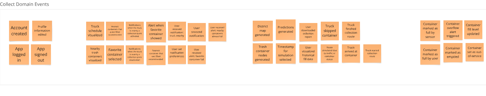 

**Paso 2: Timeline**
Organizamos todos los eventos identificados en una línea temporal, colocándolos en orden cronológico para visualizar mejor el flujo del proceso y entender la secuencia natural de acciones en el sistema.

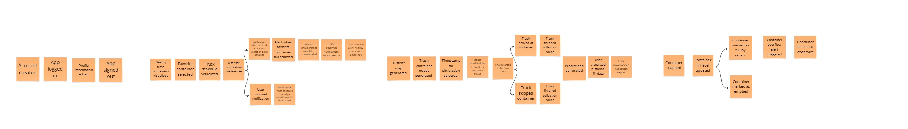 

**Paso 3: Pain and Pivotal points**
Identificamos los puntos problemáticos (pain points) y los momentos clave (pivotal points) en nuestro proceso. Estos representan áreas que requieren atención especial o que son críticas para el funcionamiento del sistema.

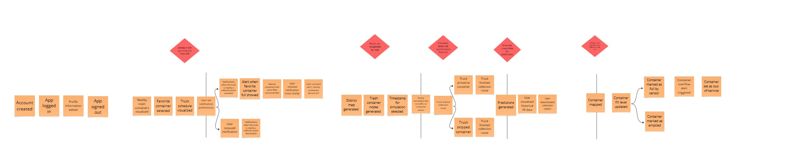 

**Paso 4: Commands**
Agregamos los comandos (representados con post-its azules) que desencadenan los eventos. Estos comandos son las acciones que los usuarios o sistemas externos realizan para provocar cambios en el sistema.

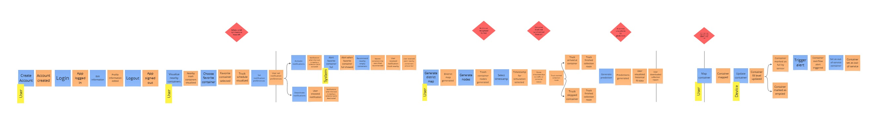 

**Paso 5: Policies**
Definimos las políticas o reglas de negocio (con post-its morados) que reaccionan a ciertos eventos y generan nuevos eventos como resultado. Estas políticas automatizan decisiones basadas en eventos previos.

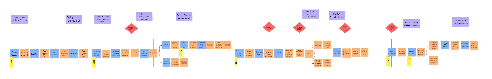 

**Paso 6: Read models**
Identificamos los modelos de lectura o vistas que los usuarios necesitan para tomar decisiones. Estos representan la información que debe estar disponible en determinados puntos del proceso.

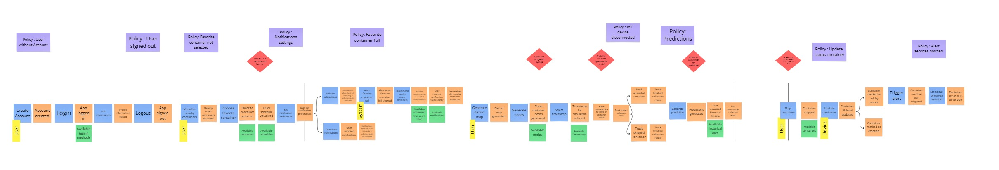 

**Paso 7: External System**
Marcamos los sistemas externos (con post-its rosados) que interactúan con nuestra solución. Estos son componentes fuera de nuestro control directo pero que tienen influencia en el proceso.

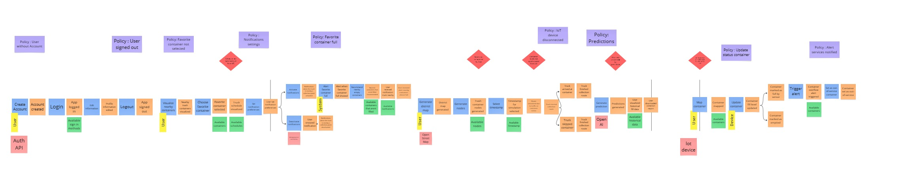 

**Paso 8: Aggregates**
Agrupamos los comandos y eventos relacionados en unidades lógicas llamadas agregados (representados con post-its amarillos). Cada agregado encapsula un conjunto coherente de funcionalidades.

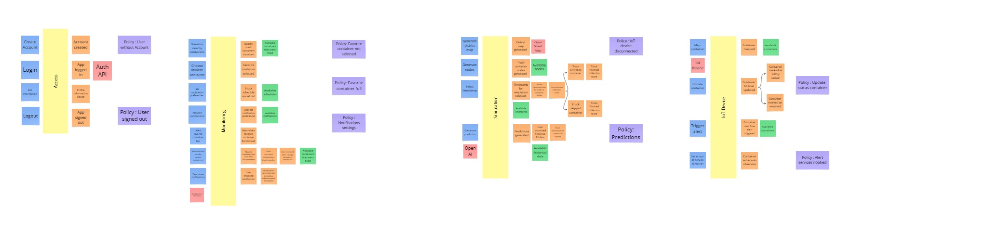 

**Paso 9: Bounded Context**
Finalmente, identificamos los contextos delimitados o bounded contexts, que son áreas de responsabilidad distintas dentro del sistema. 

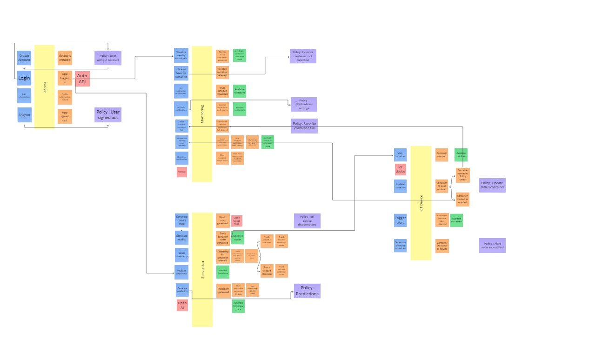 

### 4.2.2. Candidate Context Discovery

A partir del EventStorming realizado en Miro, nuestro equipo llevó a cabo una sesión de Candidate Context Discovery para identificar los bounded contexts de nuestra solución. Utilizamos principalmente la técnica look-for-pivotal-events durante la sesión.

**Proceso de identificación**

Comenzamos revisando el modelo completo que habíamos construido, prestando especial atención a los eventos pivote y agregados identificados.

 

Detección de agrupaciones naturales: Identificamos patrones y agrupaciones naturales de comandos, eventos y políticas que trabajaban sobre las mismas entidades o procesos.

 

Nos enfocamos en eventos clave como las configuraciones de notificaciones y alertas que marcan claramente transiciones entre diferentes contextos

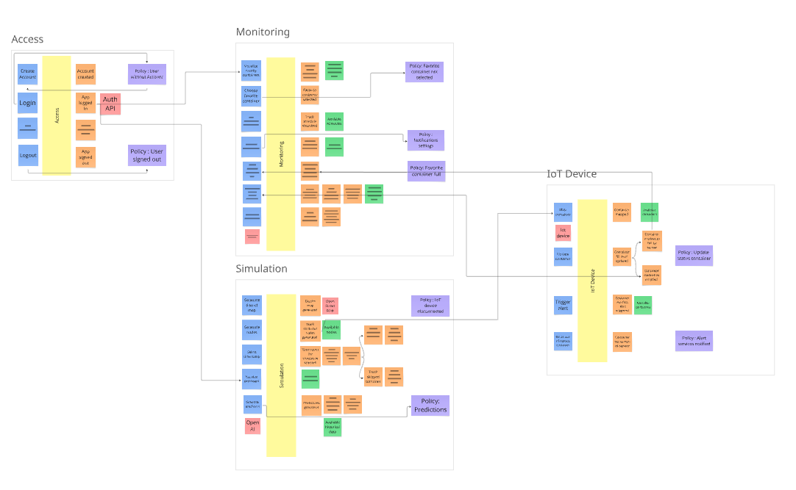 

Definición de límites: Trazamos fronteras alrededor de los grupos identificados, estableciendo los límites iniciales de nuestros bounded contexts.

Nomenclatura y validación: Nombramos cada bounded context identificado según su responsabilidad principal y validamos que tuvieran coherencia interna y límites claros.

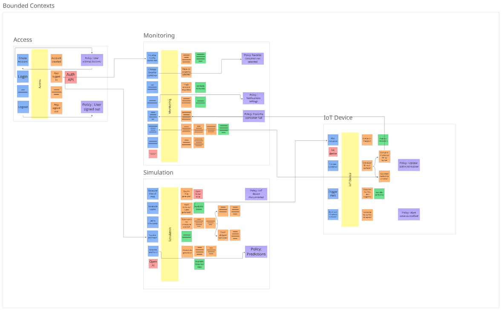 

Como resultado de este proceso, identificamos los siguientes bounded contexts para nuestra solución:

- Access: Responsable del acceso a los usuarios al sistema.
- Monitoring: Permite a los usuarios visualizar los contenedores de basura cercanos a su ubicacion, marcar uno como favorito y recibir alertas/notificaciones personalizadas sobre ese contendor, el horario de los camiones recogedores, entre otras funcionalidades.
- Simulation: Gestiona las simulaciones de las rutas optimizadas para el recojo de desechos de los contenedores inteligentes. Predicciones y configuraciones. 
- IoT Device: Responsable de las alertas del dispositivo y configuraciones del dispositivo IoT para los contenedores inteligentes.

Esta identificación nos proporcionó una base sólida para continuar con el modelado más detallado de cada contexto y sus interacciones.

### 4.2.3. Domain Message Flows Modeling

Los Domain Message Flows modelan las interacciones entre los diferentes bounded contexts, mostrando cómo se comunican entre sí mediante comandos, eventos y consultas. A continuación, presentamos los flujos de mensaje para cuatro escenarios clave de nuestra aplicación:

**Scenario 1: Access platform as a new user**

Este flujo de mensajes modela cómo un usuario nuevo accede a la plataforma WasteTrack, ilustrando las interacciones entre el usuario y el bounded context de Access, y cómo este se comunica con el contexto de Monitoring.

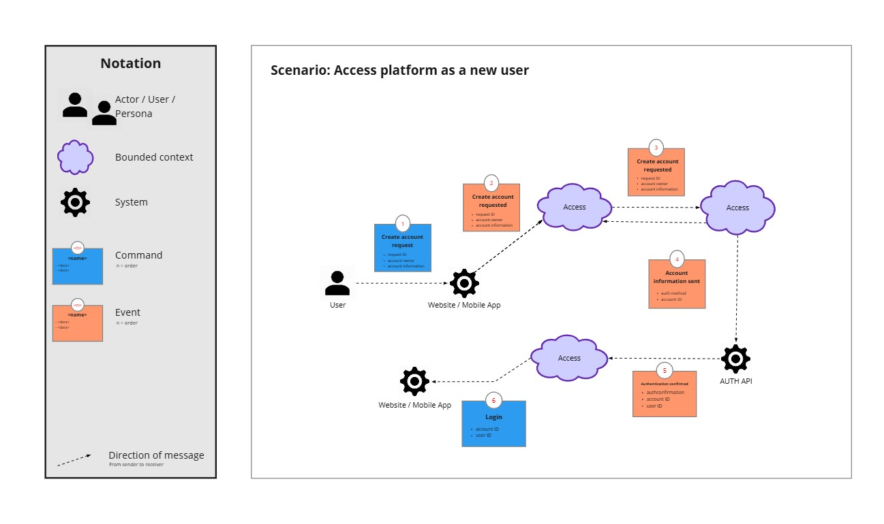 

Este flujo demuestra la relación Customer-Supplier entre Access y Monitoring, donde Access actúa como proveedor de información de autenticación y autorización.

**Scenario 2: Select favorite container**

Este flujo modela cómo un usuario selecciona un contenedor como favorito para recibir notificaciones específicas sobre su estado.

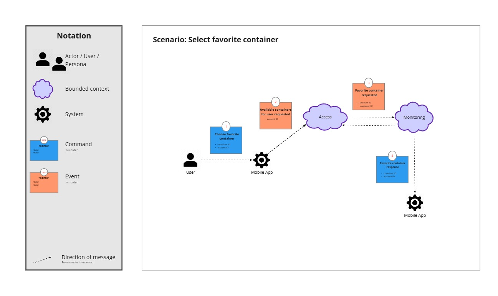 

Este flujo ilustra cómo la interacción del usuario con el sistema desencadena cambios en múltiples bounded contexts utilizando el patrón de comunicación basado en eventos.

**Scenario 3: Generating route simulation**

Este flujo muestra el proceso de generación de una simulación de ruta optimizada para la recolección de residuos.

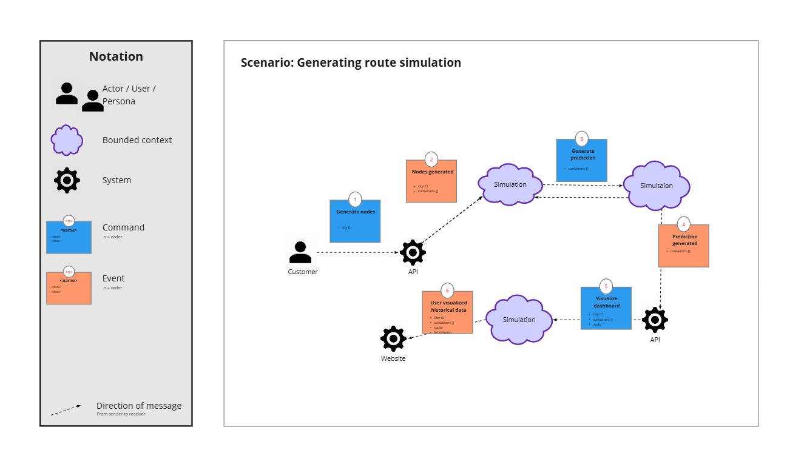 

Este flujo demuestra la relación Partnership entre Simulation y Monitoring, así como la relación Customer-Supplier entre IoT Device y Simulation.

**Scenario 4: Alert user when favorite container overflow**

Este flujo ilustra cómo el sistema detecta y notifica a un usuario cuando su contenedor favorito está por desbordarse.

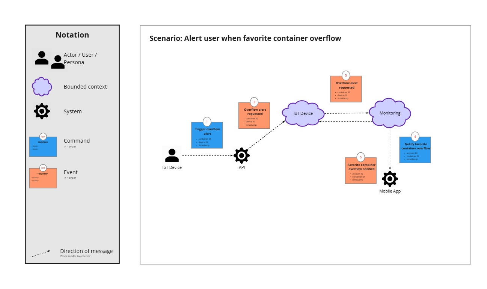 

Este flujo demuestra cómo se implementa el patrón Published Language entre IoT Device y Monitoring, permitiendo una comunicación estandarizada sobre el estado de los contenedores que beneficia directamente a los usuarios finales.

Estos flujos de mensaje son fundamentales para entender cómo los diferentes componentes de nuestro sistema interactúan entre sí, permitiéndonos identificar posibles cuellos de botella, optimizar la comunicación y garantizar que la arquitectura responda adecuadamente a los casos de uso principales.

### 4.2.4. Bounded Context Canvases

Los Bounded Context Canvases son herramientas visuales que nos permiten documentar las características fundamentales de cada contexto delimitado, capturando su propósito estratégico, modelo de dominio, lenguaje ubicuo, políticas y relaciones con otros contextos. A continuación, presentamos los canvases para nuestros cuatro bounded contexts identificados, que nos ayudaron a definir claramente las responsabilidades y límites de cada uno.

**Access Bounded Context:** Este canvas detalla nuestro contexto de acceso, responsable de la autenticación y autorización. Definimos sus principales modelos de dominio (Usuario, Rol, Permiso), las políticas de seguridad y los eventos clave como el registro de usuario y la autenticación. Su propósito estratégico es garantizar que solo los usuarios autorizados puedan acceder a funcionalidades específicas del sistema, actuando como proveedor upstream para otros contextos. El canvas ilustra claramente cómo este contexto encapsula toda la lógica relacionada con la identidad y seguridad.

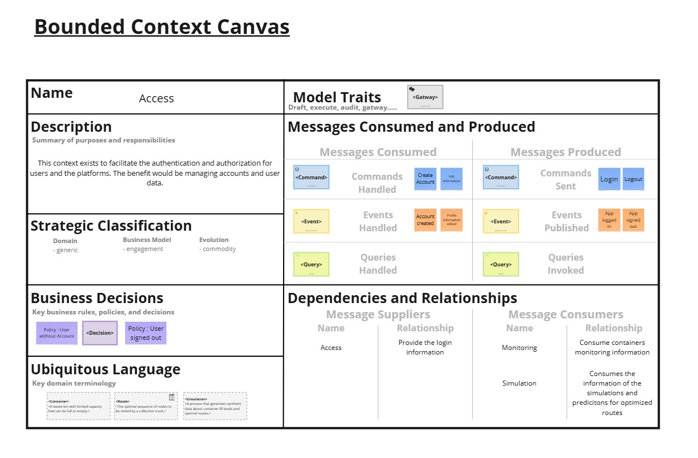

**Monitoring Bounded Context:** Este canvas muestra nuestro contexto de monitoreo, que representa el núcleo de la experiencia del usuario con la aplicación. Identificamos sus principales entidades (Contenedor, Favorito, Alerta) y las capacidades clave como visualización de contenedores en tiempo real, sistema de favoritos y notificaciones. Este contexto actúa como cliente downstream de Access e IoT Device, mientras mantiene una relación de partnership con Simulation. El canvas nos permitió visualizar la complejidad de este contexto y sus múltiples integraciones.

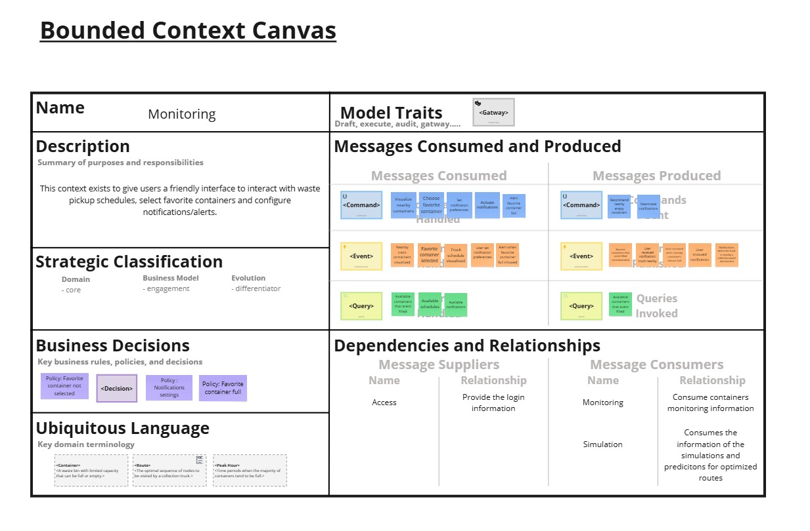

**Simulation Bounded Context:** El canvas de simulación refleja la sofisticación técnica de este contexto, mostrando su responsabilidad en la optimización de rutas y predicciones. Documentamos sus modelos de dominio principales (Ruta, Simulación, Parámetro), sus algoritmos de optimización y su dependencia de los datos históricos proporcionados por IoT Device. Este contexto implementa un ACL para transformar los datos del IoT en formatos adecuados para sus algoritmos de optimización, lo que se refleja claramente en el canvas.

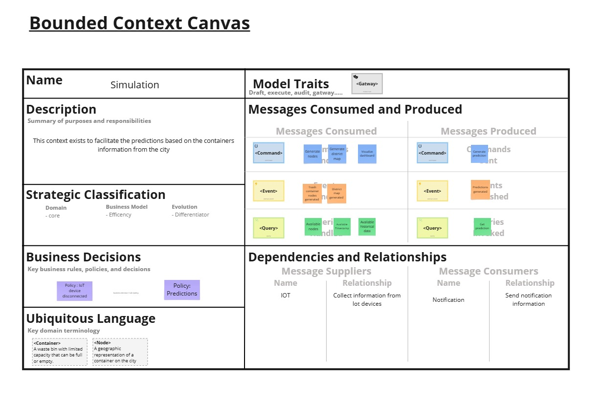

**IoT Device Bounded Context:** Este canvas presenta nuestro contexto más cercano al hardware, responsable de gestionar los dispositivos físicos y sus sensores. Identificamos sus principales agregados (Dispositivo, Sensor, Medición), los eventos que genera (como cambios en el nivel de llenado) y su rol como publicador de datos para otros contextos. El canvas muestra claramente cómo este contexto implementa un patrón Published Language para estandarizar la comunicación con Monitoring y Simulation.

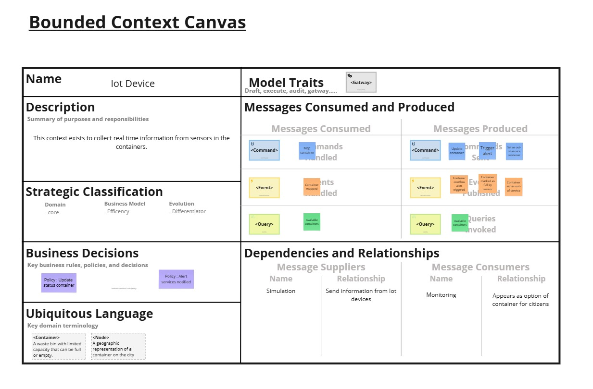

Estos canvases fueron herramientas fundamentales para definir la arquitectura de nuestra solución, permitiéndonos visualizar cada contexto como una unidad coherente con responsabilidades claras y bien definidas. Además, nos ayudaron a identificar los puntos de integración entre contextos que luego refinamos en el Context Mapping.

### 4.2.5. Context Mapping

Después de identificar nuestros bounded contexts (Access, Monitoring, Simulation e IoT Device), procedimos a definir las relaciones entre ellos mediante la técnica de Context Mapping. Este proceso nos permitió visualizar cómo estos contextos se comunican y colaboran entre sí en nuestro sistema WasteTrack.

**Proceso de elaboración**
Para elaborar nuestro Context Map, analizamos varias alternativas evaluando diferentes escenarios y relaciones posibles entre los bounded contexts:

- Alternativa 1: Modelo Inicial

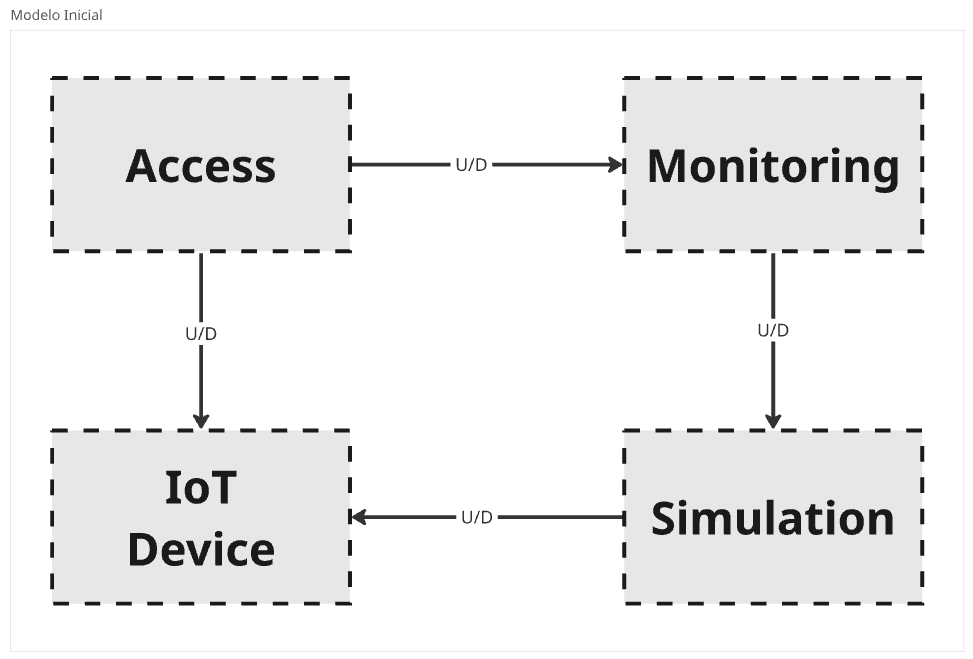 

Donde: U/D: Upstream/Downstream (relación Cliente/Proveedor)

En este modelo inicial, Access actúa como proveedor para Monitoring, proporcionando autenticación de usuarios. IoT Device suministra datos a Simulation y Monitoring para el seguimiento y optimización de rutas.

- Alternativa 2: Con Anti-corruption Layer

Consideramos la inclusión de Anti-corruption Layers para proteger los modelos de dominio:

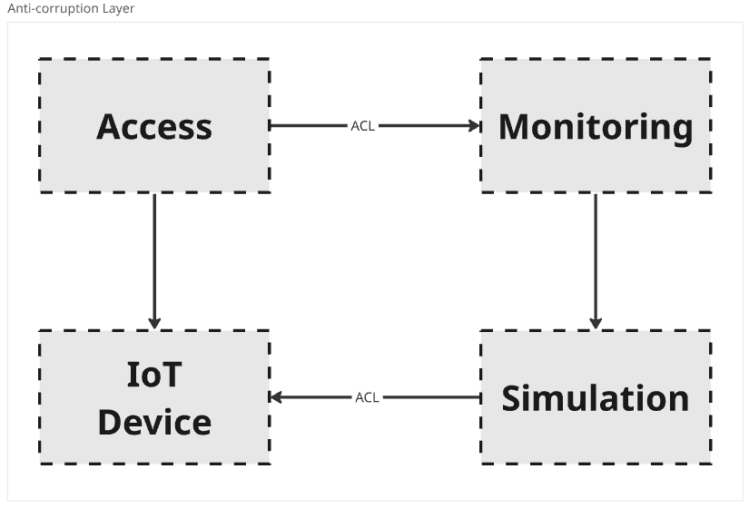 

Donde: ACL: Anti-corruption Layer

Esta alternativa añade capas de traducción para proteger los modelos de dominio cuando la comunicación cruzaba fronteras de contexto.

- Alternativa 3: Con Shared Kernel

Evaluamos si algunas funcionalidades compartidas podrían beneficiarse de un Shared Kernel:

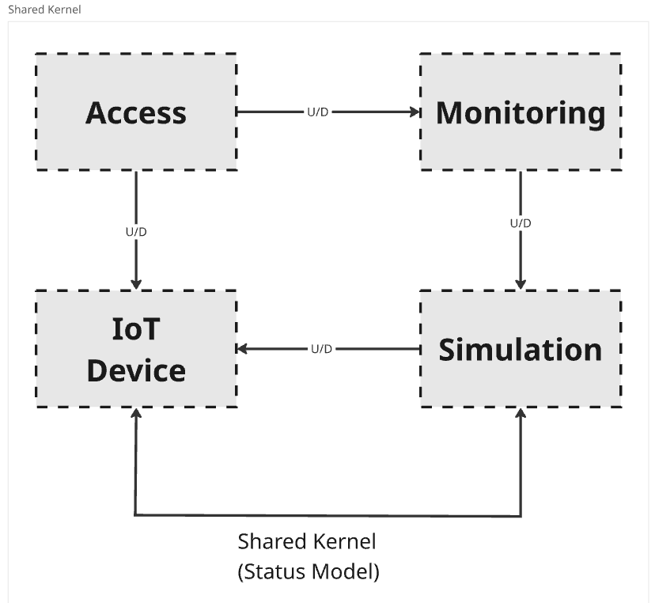 

En esta alternativa, IoT Device y Simulation comparten un kernel común para el modelo de estado de los contenedores.

**Evaluación de alternativas**
Nos planteamos las siguientes preguntas clave para evaluar nuestras alternativas:

1. ¿Qué pasaría si movemos la gestión de alertas del IoT Device al contexto de Monitoring?

- Ventaja: Simplificaría la interfaz para el usuario final
- Desventaja: Crearía una fuerte dependencia y acoplamientos indeseados

2. ¿Qué pasaría si descomponemos el capability de optimización de rutas en Simulation y movemos parte a un nuevo contexto?

- Ventaja: Mejor separación de responsabilidades
- Desventaja: Aumentaría la complejidad de coordinación entre contextos

3. ¿Qué pasaría si duplicamos la funcionalidad de consulta de estado en IoT Device y Monitoring para romper dependencias?

- Ventaja: Mayor autonomía entre contextos
- Desventaja: Posible inconsistencia de datos y mayor mantenimiento

4. ¿Qué pasaría si creamos un shared service para gestionar notificaciones entre múltiples bounded contexts?

- Ventaja: Evita duplicación de código y unifica la experiencia de notificaciones
- Desventaja: Introduce una dependencia compartida que podría limitar la evolución independiente

**Modelo de Context Map Final**

Después de evaluar todas las alternativas, optamos por el siguiente Context Map:

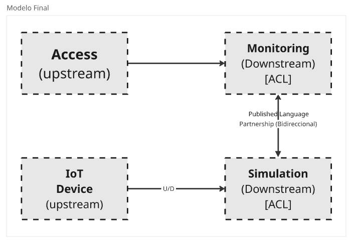 

**Relaciones entre contextos:**

1. Access ↔ Monitoring (Customer-Supplier):

- Access actúa como proveedor (Upstream) proporcionando autenticación y autorización
- Monitoring actúa como cliente (Downstream) consumiendo la información de usuarios autenticados
- Se implementa un Anti-corruption Layer en Monitoring para traducir el modelo de usuario de Access

2. IoT Device ↔ Monitoring (Published Language):

- IoT Device publica datos de sensores en un formato estandarizado
- Monitoring se suscribe a estos datos para mostrar información en tiempo real
- Ambos contextos acuerdan un lenguaje común para la comunicación

3. IoT Device ↔ Simulation (Customer-Supplier):

- IoT Device proporciona datos históricos y en tiempo real (Upstream)
- Simulation consume estos datos para generar predicciones y optimizar rutas (Downstream)
- Simulation implementa un Anti-corruption Layer para transformar los datos del IoT

4. Simulation ↔ Monitoring (Partnership):

- Ambos contextos colaboran estrechamente para proporcionar una experiencia completa
- Comparten algunos modelos y conceptos, pero mantienen su independencia
- La comunicación es bidireccional y fluida

**Justificación:**

Elegimos este modelo porque:

1. Mantiene una clara separación de responsabilidades entre contextos
2. Usa Anti-corruption Layers donde es necesario proteger los modelos de dominio
3. Establece un Published Language para estandarizar la comunicación entre IoT Device y otros contextos
4. Crea una Partnership entre Simulation y Monitoring que refleja su estrecha colaboración
5. Evita la creación de dependencias innecesarias que dificultarían la evolución del sistema
6. Permite que cada equipo trabaje con autonomía en su bounded context

Este Context Map proporciona una base sólida para el desarrollo de nuestro sistema WasteTrack, facilitando la comunicación entre equipos y estableciendo claramente las interacciones entre los diferentes dominios de la aplicación.

### 4.3. Software Architecture
En esta sección se presentan los diagramas de arquitectura de la solución, que ilustran la estructura y los componentes clave. Estos diagramas son fundamentales para comprender cómo se organizan y comunican los diferentes components del sistema.
#### 4.3.1. Software Architecture System Landscape Diagram
Diagrama de arquitectura Landscape, gráfica a un nivel general, sin detallar explicitamente los componentes del sistema. En este diagrama se puede observar la relación entre el sistema y los actores externos que interactúan con él.

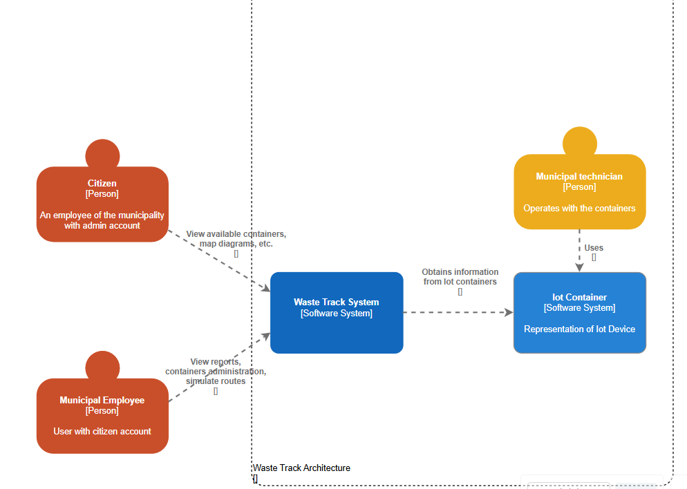

#### 4.3.2. Software Architecture Context Level Diagrams
Diagrama de arquitectura de contexto de Waste Track. En el cual podemos identificar los principales usuarios y cómo estos se relacionan con el sistema. Además se grafica cuales son las relaciones entre el sistema y servicios externos que proveen funcionalidades adicionales a la solución. 

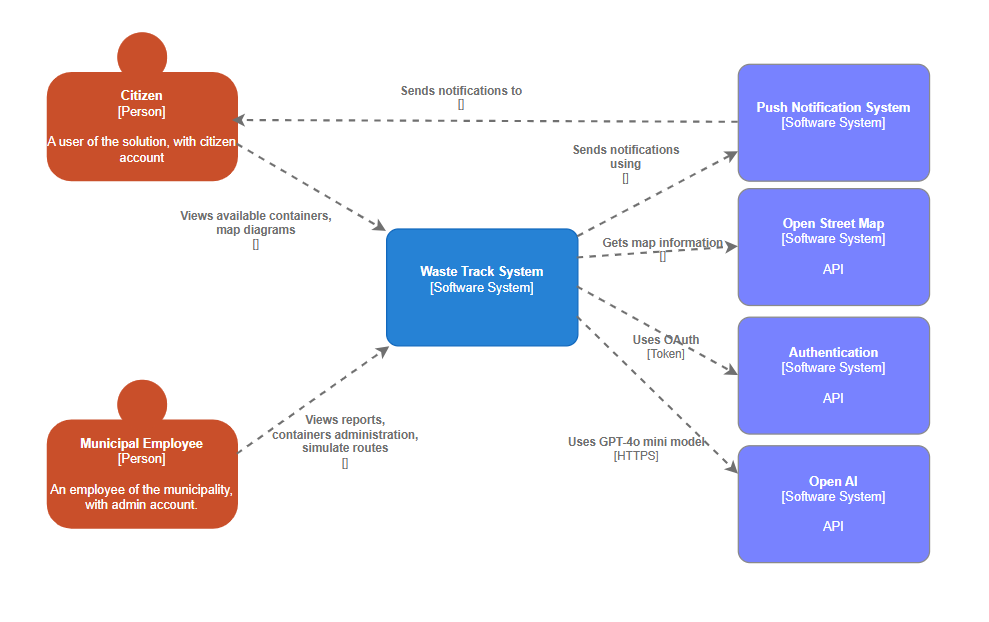 

#### 4.3.3. Software Architecture Container Level Diagrams
Diagrama de arquitectura de contenedores, incluye aplicaciones web y móvil, bases de datos, APIs y servicios externos que conforman la solución.

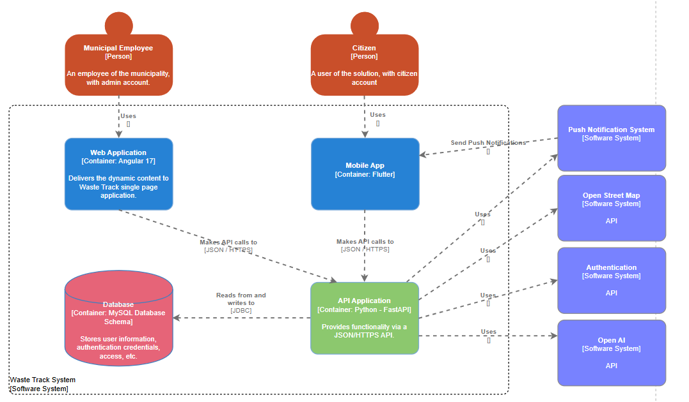

#### 4.3.4. Software Architecture Deployment Diagrams
Diagrama de arquitectura de despliegue, principalmente se describen las tecnologías y proveedores de nube que se utilizarán para implementar la solución.

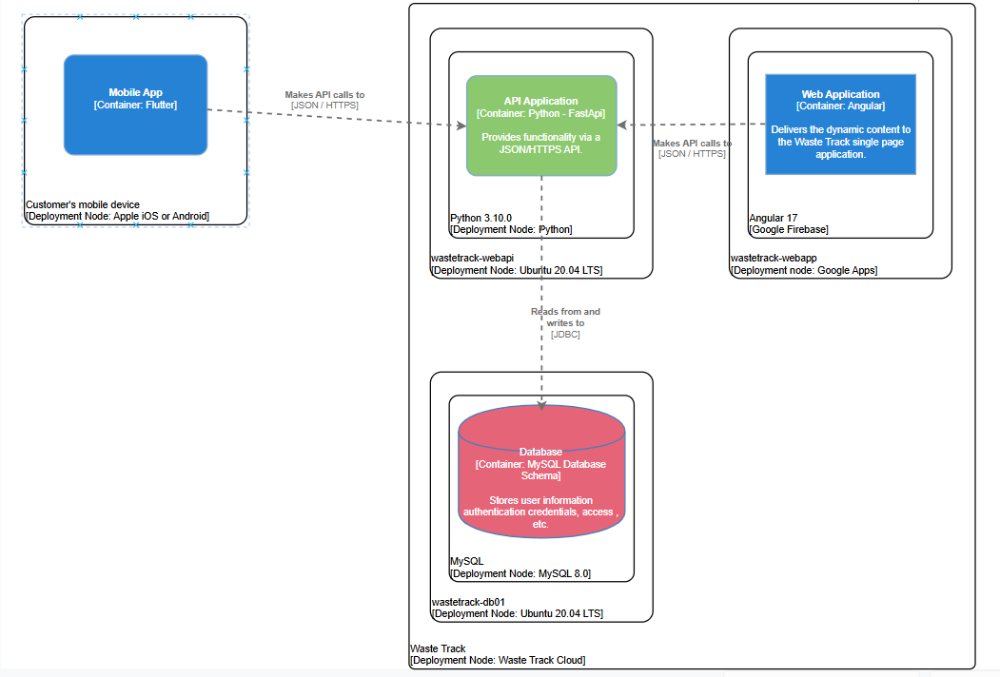