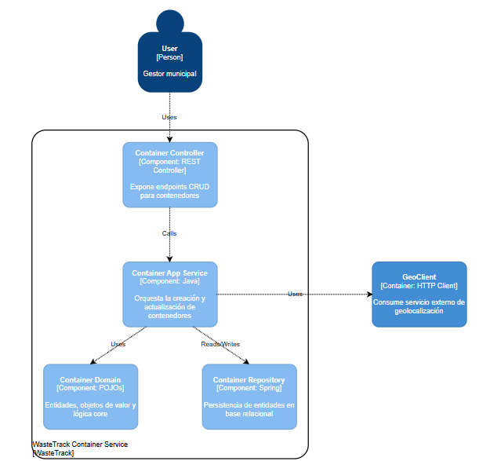
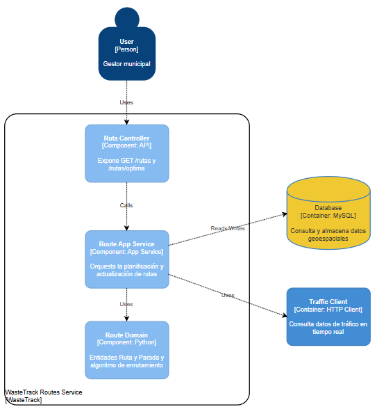
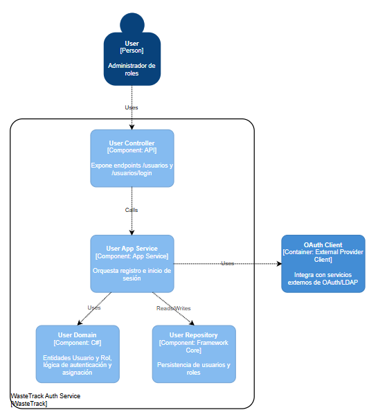

# Capítulo V: Tactical-Level Software Design

## 5.1 Bounded Context: Gestión de contenedores

Este Bounded Context abarca todo lo relacionado con la representación, configuración y estado de los contenedores de residuos. Se encarga de la modelización de la entidad Contenedor (con su ubicación, umbral de llenado y tipo de residuo), las reglas de negocio para actualizar su estado (por ejemplo, marcar un contenedor como “lleno”) y la persis­tencia de esa información. Aquí se definen los límites claros de cómo se crean, modifican y validan los contenedores, así como sus interacciones con servicios externos (p.ej. geocodificación).

### 5.1.1. Domain Layer

| Tipo            | Nombre                         | Descripción                                                                                          |
| --------------- | ------------------------------ | ---------------------------------------------------------------------------------------------------- |
| Entidad         | **Contenedor**                 | Representa un depósito de residuos con su identificador, estado (vacío/medio/lleno) y configuración. |
| Entidad         | **Ubicación**                  | Define la referencia física (nombre de calle, zona) para agrupar y localizar contenedores.           |
| Entidad         | **TipoResiduo**                | Categoría de residuo (orgánico, reciclable, peligroso) que determina qué se puede depositar.         |
| Objeto de Valor | **CoordenadasGPS**             | Agrupa latitud y longitud para ubicar el contenedor con precisión; dos iguales son equivalentes.     |
| Objeto de Valor | **UmbralLlenado**              | Porcentaje o valor que marca el punto de alerta antes de que el contenedor esté completamente lleno. |
| Domain Service  | **AsignarUbicación**           | Lógica para determinar y asignar la zona o coordenadas de un nuevo contenedor.                       |
| Domain Service  | **ActualizarEstadoContenedor** | Compara nuevas lecturas con el umbral y actualiza el estado interno (`vacío`, `medio`, `lleno`).     |
| Domain Event    | **ContenedorLleno**            | Evento que se dispara cuando el nivel supera el 100 % o el umbral configurado.                       |
| Domain Event    | **CambioEstadoContenedor**     | Evento que comunica cualquier variación de estado para auditoría y desencadenar procesos.            |

### 5.1.2. Interface Layer

| Tipo           | Nombre / Endpoint                | Descripción                                                                                   |
| -------------- | -------------------------------- | --------------------------------------------------------------------------------------------- |
| API REST       | **`GET /api/contenedores`**      | Obtiene el listado de contenedores, con filtros por zona, tipo de residuo o nivel de llenado. |
| API REST       | **`GET /api/contenedores/{id}`** | Devuelve detalles de un contenedor específico (ubicación, umbral, tipo y último nivel leído). |
| Interfaz de UI | **Panel de administración**      | Vista web donde usuarios municipales crean, editan parámetros y ven alertas de contenedores.  |

### 5.1.3. Application Layer

| Tipo                | Nombre                            | Descripción                                                                                       |
| ------------------- | --------------------------------- | ------------------------------------------------------------------------------------------------- |
| Use Case            | **RegistrarContenedor**           | Orquesta la creación: valida datos, crea la entidad y guarda el contenedor.                       |
| Use Case            | **ModificarParametrosContenedor** | Permite ajustar umbral, tipo de residuo o prioridad, validando restricciones.                     |
| Application Service | **GestorContenedoresService**     | Fachada que agrupa casos de uso, maneja transacciones y adapta DTOs a entidades de dominio.       |
| DTO                 | **ContenedorDTO**                 | Transporta datos para crear o actualizar contenedores (id, coordenadas, umbral, tipo de residuo). |
| DTO                 | **UbicacionDTO**                  | Aísla la información de localización (zona, lat/lng) entre UI y capa de aplicación.               |

### 5.1.4. Infrastructure Layer

| Tipo        | Nombre                                    | Descripción                                                                    |
| ----------- | ----------------------------------------- | ------------------------------------------------------------------------------ |
| Persistence | **Repositorio de contenedores**           | Implementación concreta que gestiona CRUD de entidades en base relacional.     |
| Integración | **Servicios de geolocalización externos** | Cliente externo que traduce direcciones o zonas a coordenadas GPS y viceversa. |

### 5.1.5. Bounded Context Software Architecture Component Level Diagrams

 

### 5.1.6. Bounded Context Software Architecture Code Level Diagrams

#### 5.1.6.1 Bounded Context Domain Layer Class Diagrams

 

#### 5.1.6.2 Bounded Context Database Design Diagrams

 

## 5.2 Bounded Context: Optimización de Rutas

Este Bounded Context contiene el modelo y la lógica para planificar y recalcular rutas de recolección eficientes. Define la entidad Ruta con sus paradas, ventanas de tiempo y criterios de prioridad, y utiliza datos de tráfico en tiempo real y servicios geoespaciales para generar itinerarios óptimos. Su frontera separa la lógica de enrutamiento de la manipulación de datos de sensores o la gestión de usuarios.

### 5.2.1. Domain Layer

| Tipo                | Nombre            | Descripción                                                                                             |
| ------------------- | ----------------- | ------------------------------------------------------------------------------------------------------- |
| **Entidad**         | RutaRecolección   | Modelo que agrupa una serie de paradas y asigna un camión para cubrir todo el recorrido de recolección. |
| **Entidad**         | Camión            | Representa el vehículo usado para recolectar residuos, con capacidad, identificador y estado operativo. |
| **Objeto de Valor** | Parada            | Punto geográfico dentro de una ruta, con coordenadas y orden de visita.                                 |
| **Objeto de Valor** | Horario           | Ventana de tiempo (hora de inicio y fin) en la que se debe realizar la parada.                          |
| **Domain Service**  | GenerarRutaOptima | Lógica de negocio que calcula la mejor secuencia de paradas para minimizar distancia y tiempo total.    |
| **Domain Event**    | RutaGenerada      | Evento que se emite una vez que se ha calculado y almacenado una ruta óptima.                           |
| **Domain Event**    | ActualizacionRuta | Evento que indica que, tras cambios en datos o condiciones, la ruta ha sido recalculada.                |

### 5.2.2. Interface Layer

| Tipo         | Nombre / Endpoint         | Descripción                                                                                      |
| ------------ | ------------------------- | ------------------------------------------------------------------------------------------------ |
| **API REST** | `GET /api/rutas`          | Devuelve todas las rutas registradas y sus metadatos (paradas incluidas, camión asignado, etc.). |
| **API REST** | `GET /api/rutas/optima`   | Calcula o devuelve la ruta más eficiente para una zona o criterios específicos.                  |
| **UI**       | Mapa interactivo de rutas | Vista gráfica donde se muestran las rutas en un mapa, con paradas y estado de cada camión.       |

### 5.2.3. Application Layer

| Tipo                    | Nombre                  | Descripción                                                                                              |
| ----------------------- | ----------------------- | -------------------------------------------------------------------------------------------------------- |
| **Use Case**            | PlanificarRutas         | Caso de uso que recibe parámetros (zona, prioridades) y orquesta el cálculo de una nueva ruta.           |
| **Use Case**            | ActualizarRuta          | Caso de uso que recalcula una ruta existente tras cambios en condiciones (tráfico, nuevos contenedores). |
| **Application Service** | OptimizacionRutaService | Fachada que agrupa los casos de uso de planificación y actualización, y gestiona transacciones.          |
| **DTO**                 | RutaDTO                 | Objeto plano que transporta datos de la ruta (lista de paradas, tiempos estimados, camión asignado).     |
| **DTO**                 | CamionDTO               | Objeto plano con los datos de un camión (capacidad, identificador, estado) para ser usado en la UI/API.  |

### 5.2.4. Infrastructure Layer

| Tipo             | Nombre                                      | Descripción                                                                                         |
| ---------------- | ------------------------------------------- | --------------------------------------------------------------------------------------------------- |
| **Persistencia** | Base de datos geoespacial (PostGIS, etc.)   | Almacena entidades RutaRecolección y Parada con soporte de consultas espaciales (distancias, etc.). |
| **Integración**  | Servicios de mapas y tráfico en tiempo real | APIs externas que proporcionan información de calles, rutas óptimas y congestión de tráfico.        |

### 5.2.5. Bounded Context Software Architecture Component Level Diagrams

 

### 5.2.6. Bounded Context Software Architecture Code Level Diagrams

#### 5.2.6.1 Bounded Context Domain Layer Class Diagrams

 

#### 5.2.6.2 Bounded Context Database Design Diagrams

 

## 5.3 Bounded Context: Gestión de Usuarios

Aquí se concentra todo lo relativo a la identidad, autenticación y autorización de los actores del sistema (municipales, operarios y ciudadanos). Modela las entidades Usuario y Rol, gestiona el registro, el inicio de sesión y la asignación de permisos, e integra proveedores de identidad externos (OAuth2, LDAP). Su límite garantiza que las políticas de acceso se apliquen de forma consistente en toda la plataforma.

### 5.3.1. Domain Layer

| Tipo                | Nombre             | Descripción                                                                                                   |
| ------------------- | ------------------ | ------------------------------------------------------------------------------------------------------------- |
| **Entidad**         | Usuario            | Representa a un usuario de la plataforma, con identificador, datos personales y roles asignados.              |
| **Entidad**         | Rol                | Define un conjunto de permisos y responsabilidades (p. ej. “Municipal”, “Operario”, “Ciudadano”).             |
| **Objeto de Valor** | Credenciales       | Agrupa email y contraseña hasheada para autenticar al usuario; se considera inmutable y sin identidad propia. |
| **Objeto de Valor** | Permisos           | Conjunto de flags o privilegios (leer, escribir, administrar) que definen lo que puede hacer el usuario.      |
| **Domain Service**  | AutenticarUsuario  | Lógica que valida las credenciales y genera un token o sesión si coinciden con un usuario registrado.         |
| **Domain Service**  | AsignarRol         | Regla de negocio que asocia uno o varios roles a un usuario, respetando restricciones de jerarquía.           |
| **Domain Event**    | UsuarioAutenticado | Evento que se dispara cuando un usuario inicia sesión exitosamente, para auditar o notificar otros sistemas.  |
| **Domain Event**    | RolAsignado        | Evento que indica que a un usuario se le ha otorgado un nuevo rol; puede desencadenar cambios en permisos.    |

### 5.3.2. Interface Layer

| Tipo         | Nombre / Endpoint            | Descripción                                                                                        |
| ------------ | ---------------------------- | -------------------------------------------------------------------------------------------------- |
| **API REST** | `GET /api/usuarios`          | Devuelve el listado de usuarios registrados, con filtros por rol o estado.                         |
| **API REST** | `POST /api/usuarios/login`   | Recibe email y contraseña, devuelve token de autenticación si las credenciales son válidas.        |
| **UI**       | Panel de gestión de usuarios | Interfaz administrativa donde se crean, editan y eliminan usuarios, y se asignan roles y permisos. |

### 5.3.3. Application Layer

| Tipo                    | Nombre                 | Descripción                                                                                            |
| ----------------------- | ---------------------- | ------------------------------------------------------------------------------------------------------ |
| **Use Case**            | RegistrarUsuario       | Caso de uso que valida datos de registro, crea la entidad Usuario y persiste sus credenciales.         |
| **Use Case**            | IniciarSesion          | Caso de uso que autentica al usuario mediante el servicio de dominio y devuelve un token válido.       |
| **Application Service** | GestionUsuariosService | Fachada que agrupa los casos de uso de registro e inicio de sesión, maneja transacciones y mapea DTOs. |
| **DTO**                 | UsuarioDTO             | Transporta los datos necesarios para mostrar o modificar un usuario (id, nombre, email, roles).        |
| **DTO**                 | RolDTO                 | Transporta información de un rol (id, nombre, descripción) entre la UI/API y la capa de aplicación.    |

### 5.3.4. Infrastructure Layer

| Tipo             | Nombre                                           | Descripción                                                                                      |
| ---------------- | ------------------------------------------------ | ------------------------------------------------------------------------------------------------ |
| **Persistencia** | Base de datos de usuarios y roles                | Almacena las tablas `usuarios`, `roles` y la intermedia `usuario_rol` en un RDBMS (MySQL, etc.). |
| **Integración**  | Servicios de autenticación externa (OAuth, LDAP) | Permite validar credenciales o gestionar identidad federada usando proveedores externos.         |

### 5.3.5. Bounded Context Software Architecture Component Level Diagrams

 

### 5.3.6. Bounded Context Software Architecture Code Level Diagrams

#### 5.3.6.1 Bounded Context Domain Layer Class Diagrams

 

#### 5.3.6.2 Bounded Context Database Design Diagrams

 
