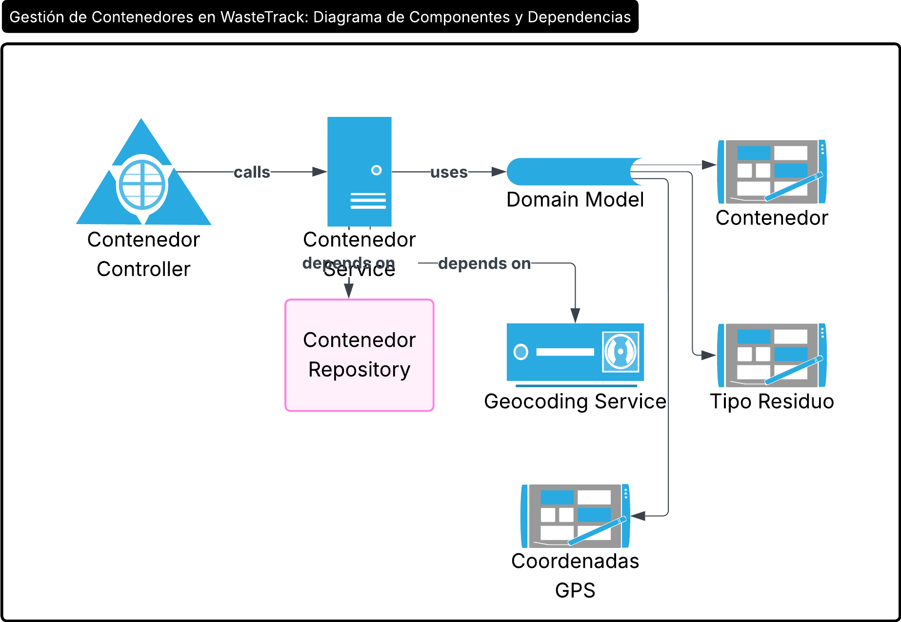
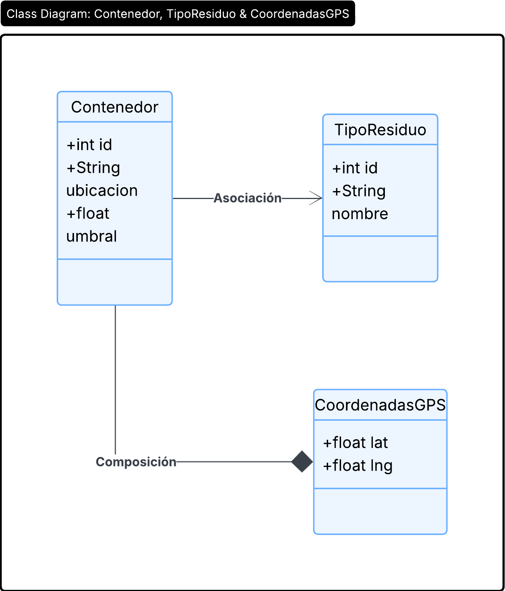
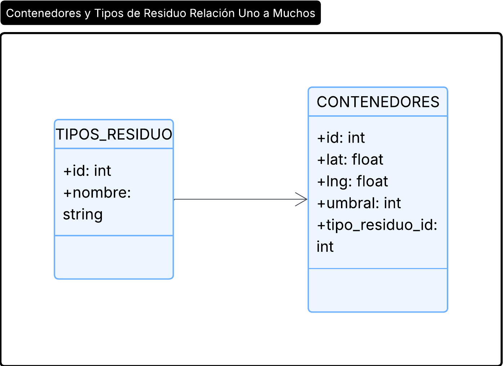
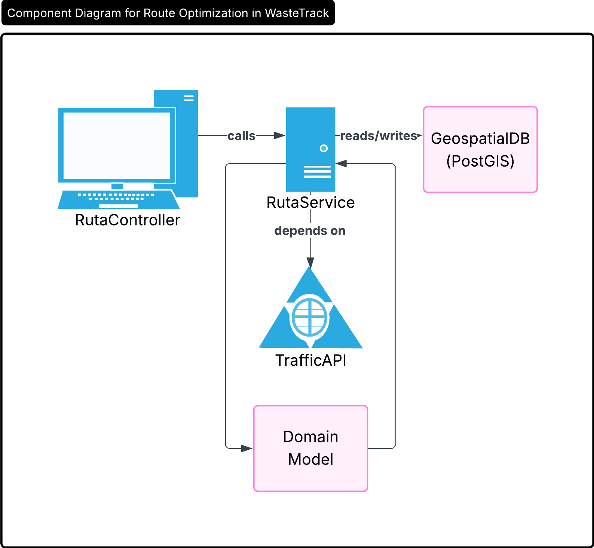
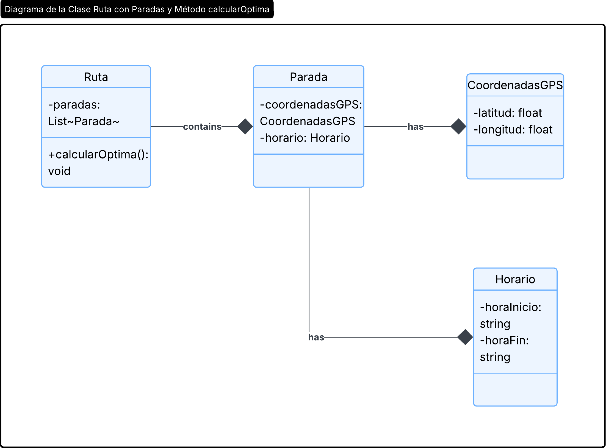
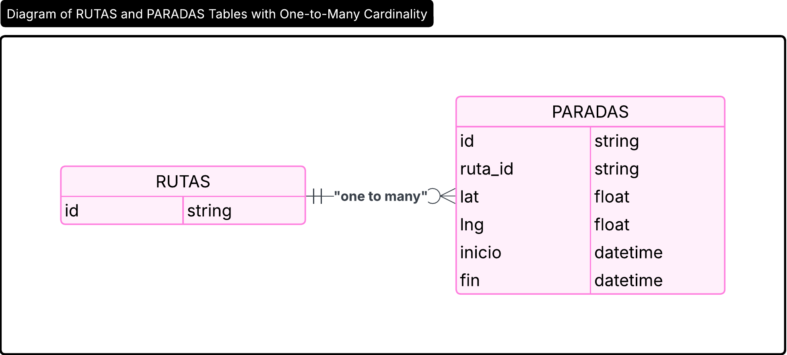
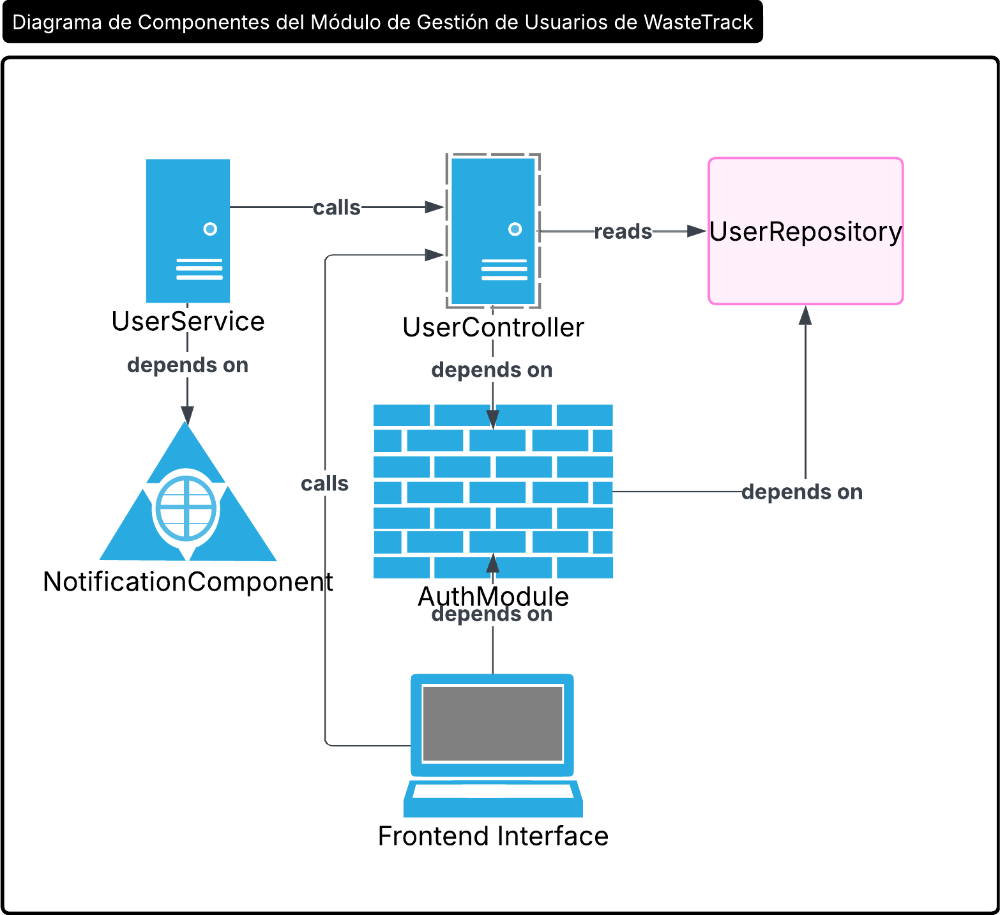
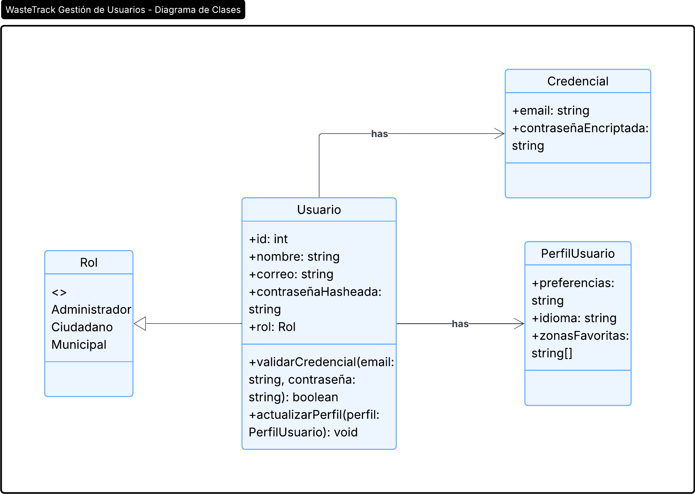
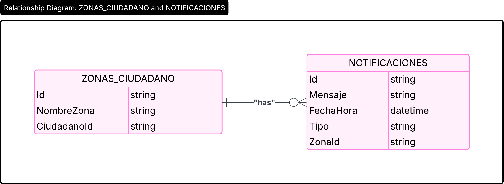

# Capítulo V: Tactical-Level Software Design

## 5.1 Bounded Context: Gestión de contenedores

Este Bounded Context abarca todo lo relacionado con la representación, configuración y estado de los contenedores de residuos. Se encarga de la modelización de la entidad Contenedor (con su ubicación, umbral de llenado y tipo de residuo), las reglas de negocio para actualizar su estado (por ejemplo, marcar un contenedor como “lleno”) y la persis­tencia de esa información. Aquí se definen los límites claros de cómo se crean, modifican y validan los contenedores, así como sus interacciones con servicios externos (p.ej. geocodificación).

### 5.1.1. Domain Layer

- **Entities:** Contenedor, Ubicación, TipoResiduo.
- **Value Objects:** CoordenadasGPS, UmbralLenado.
- **Domain Services:** AsignarUbicación, ActualizarEstadoContenedor.
- **Domain Events:** ContenedorLleno, CambioEstadoContenedor.

### 5.1.2. Interface Layer

- **APIs REST:** /api/contenedores, GET /api/contenedores/{id}.
- **User Interfaces:** Panel de administración de contenedores.

### 5.1.3. Application Layer

- **Use Cases:** RegistrarContenedor, ModificarParametrosContenedor.
- **Aplication Services:** GestorContenedoresService.
- **DTOs:** ContenedorDTO, UbicacioDTO.

### 5.1.4. Infrastructure Layer

- **Persistance:** Repositorio de contenedores dentro de la base de datos (relacional).
- **Integrations:** Servicios de geolocalización externos.

### 5.1.5. Bounded Context Software Architecture Component Level Diagrams

 

### 5.1.6. Bounded Context Software Architecture Code Level Diagrams

#### 5.1.6.1 Bounded Context Domain Layer Class Diagrams

 

#### 5.1.6.2 Bounded Context Database Design Diagrams

 

## 5.2 Bounded Context: Optimización de Rutas

Este Bounded Context contiene el modelo y la lógica para planificar y recalcular rutas de recolección eficientes. Define la entidad Ruta con sus paradas, ventanas de tiempo y criterios de prioridad, y utiliza datos de tráfico en tiempo real y servicios geoespaciales para generar itinerarios óptimos. Su frontera separa la lógica de enrutamiento de la manipulación de datos de sensores o la gestión de usuarios.

### 5.2.1. Domain Layer

- **Entities:** RutaRecolección, Camión.
- **Value Objects:** Parada, Horario.
- **Domain Services:** GenerarRutaOptima.
- **Domain Events:** RutaGenerada, ActualizacionRuta.

### 5.2.2. Interface Layer

- **APIs REST:** /api/rutas, GET /api/rutas/optima.
- **User Interfaces:** Mapa interactivo de las rutas de los camiones.

### 5.2.3. Application Layer

- **Use Cases:** PlanificarRutas, ActualizarRuta.
- **Aplication Services:** OptimizacionRutaService.
- **DTOs:** RutaDTO, CamionDTO.

### 5.2.4. Infrastructure Layer

- **Persistance:** Base de datos geoespacial para rutas y paradas.
- **Integrations:** Servicios de mapas y tráfico en tiempo real.

### 5.2.5. Bounded Context Software Architecture Component Level Diagrams

 

### 5.2.6. Bounded Context Software Architecture Code Level Diagrams

#### 5.2.6.1 Bounded Context Domain Layer Class Diagrams

 

#### 5.2.6.2 Bounded Context Database Design Diagrams

 

## 5.3 Bounded Context: Gestión de Usuarios

Aquí se concentra todo lo relativo a la identidad, autenticación y autorización de los actores del sistema (municipales, operarios y ciudadanos). Modela las entidades Usuario y Rol, gestiona el registro, el inicio de sesión y la asignación de permisos, e integra proveedores de identidad externos (OAuth2, LDAP). Su límite garantiza que las políticas de acceso se apliquen de forma consistente en toda la plataforma.

### 5.3.1. Domain Layer

- **Entities:** Usuario, Rol.
- **Value Objects:** Credenciales, Permisos.
- **Domain Services:** AutenticarUsuario, AsignarRol.
- **Domain Events:** UsuarioAutenticado, RolAsignado.

### 5.3.2. Interface Layer

- **APIs REST:** /api/usuarios, POST /api/usuarios/login.
- **User Interfaces:** Panel de gestión de usuarios.

### 5.3.3. Application Layer

- **Use Cases:** RegistrarUsuario, IniciarSesion.
- **Aplication Services:** GestionUsuariosService.
- **DTOs:** UsuarioDTO, RolDTO.

### 5.3.4. Infrastructure Layer

- **Persistance:** Base de datos de usuarios y roles.
- **Integrations:** Servicios de autenticación externa (OAuth, LDAP).

### 5.3.5. Bounded Context Software Architecture Component Level Diagrams

 

### 5.3.6. Bounded Context Software Architecture Code Level Diagrams

#### 5.3.6.1 Bounded Context Domain Layer Class Diagrams

 

#### 5.3.6.2 Bounded Context Database Design Diagrams

 
